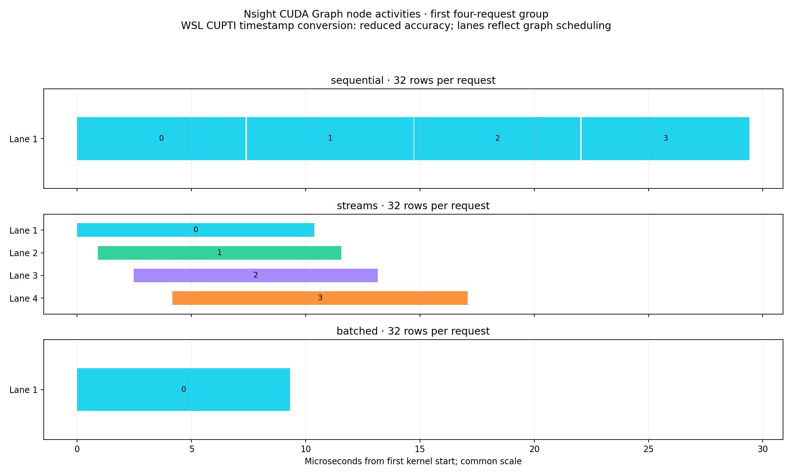
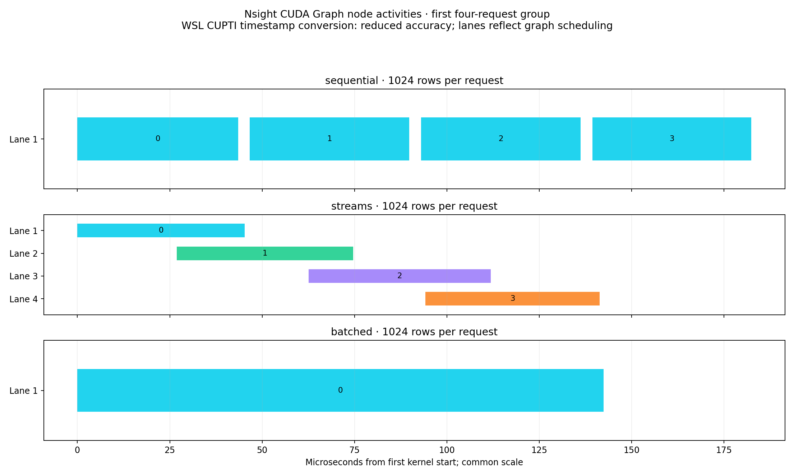
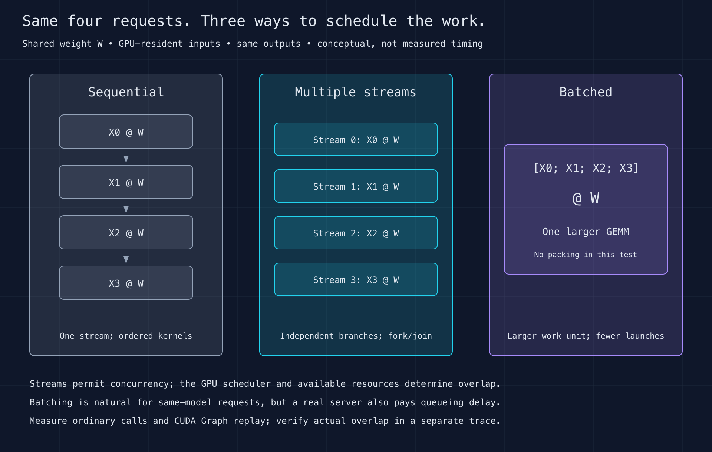

# Sequential compute, multiple streams, or batching?

Question: for four requests to the same model layer, is it better to issue four
GEMMs sequentially, submit them on independent CUDA streams, or combine the inputs
into one larger GEMM?

## Measured results

Completed September 8, 2026 on RTX 4070 SUPER: **54 cases, 16,379 timed blocks,
6,722,019 four-request groups** across three repetitions. Elapsed time was
4 minutes 38 seconds, including 4.51 minutes of measured blocks. Numerical checks,
the independent raw-sample audit, and executed-source hash verification passed.

**Batching was fastest in all six size/submission combinations.** Four streams
were slower for small ordinary calls, but improved over sequential execution
when CUDA Graph replay reduced submission overhead.

| Submission | Rows/request | Sequential µs | Four streams µs | Batched µs | Batch speedup vs sequential |
| --- | ---: | ---: | ---: | ---: | ---: |
| Ordinary | 32 | 44.13 | 119.80 | 18.75 | 2.35× |
| Ordinary | 256 | 63.03 | 115.83 | 43.10 | 1.46× |
| Ordinary | 1024 | 170.05 | 149.96 | 133.72 | 1.27× |
| CUDA Graph | 32 | 27.35 | 16.60 | 8.74 | 3.13× |
| CUDA Graph | 256 | 58.43 | 43.85 | 41.79 | 1.40× |
| CUDA Graph | 1024 | 166.23 | 136.75 | 131.37 | 1.27× |

Times are per **four-request group**, taking the median of three repeat medians.
For 32 rows/request, graph replay made four streams **1.65× faster** than graph
sequential execution, while batching was **3.13× faster**. Ordinary streamed
submission was **2.71× slower** than ordinary sequential submission at that size.
These measurements support choosing batching for this shared-weight, preassembled
workload. They do not include the queueing delay of forming a batch in a server.


[SVG chart](results/baseline-v1/latency.svg) ·
[Detailed report](results/baseline-v1/report.md) ·
[CSV measurements](results/baseline-v1/timings.csv) ·
[Independent audit](results/baseline-v1/audit.json)

## Observed compute concurrency

Separate Nsight Systems node traces recorded **up to four overlapping kernel
intervals** with 32 rows/request, and **up to two** with 1024 rows/request, for
the four-branch streamed graph. Sequential and batched graphs recorded a maximum
of one active kernel interval. Four stream branches therefore did not imply four
simultaneous kernels at every size.



[SVG small-input timeline](results/baseline-v1/timeline-32.svg)



[SVG large-input timeline](results/baseline-v1/timeline-1024.svg)

These show the first group from eight profiled graph replays, with a common time
scale within each figure. Bar numbers indicate chronological kernel order, not
request identity. Lanes are remapped profiler stream identifiers. The WSL CUPTI
timestamp workaround reduces timestamp accuracy; interpret the broad overlap
pattern, not tiny boundary differences. Throughput claims come from the separate
uninstrumented benchmark, not these captures.



[SVG strategy diagram](diagram/strategies.svg)

## Equal-work comparison

Each request computes `Y_i = X_i @ W` using the same resident BF16 weight matrix.
K=N=1024, with 32, 256 or 1024 rows per request. The three strategies perform the
same mathematical work and produce the same output shape and ordering:

| Strategy | Submission |
| --- | --- |
| Sequential | Four GEMMs on one stream |
| Streams | Four independent GEMMs on four streams, with a fork/join around the group |
| Batched | Flatten the four contiguous input slices and issue one larger GEMM |

The inputs, weight, output buffers and tensor views are allocated before timing.
Batching uses an existing contiguous layout, so there is no timed packing/copy cost.
This is one larger shared-weight matrix multiplication, not four separate weight
matrices passed to `bmm`. There are no CPU/GPU transfers in this study.

All branches fork before any joins; joining a branch before launching the next
would accidentally serialize the supposed parallel path. Dependencies permit
concurrent execution, but the CUDA scheduler decides whether kernels actually
overlap. Streams share the GPU's compute and memory resources.

Each strategy is measured with ordinary Python submission and with CUDA Graph
replay. Graphs preserve the dependency structure while reducing repeated Python
and launch overhead. CUDA Graph execution may use internal scheduling streams;
the captured four branches do not guarantee four simultaneous kernels.

## Why this is realistic—and what it excludes

Batching is the primary serving scenario when requests use the same weights and
compatible shapes. It can improve matrix-multiplication efficiency and reduce
launch count. Multiple streams are useful controls and can also serve independent
models or heterogeneous operations, where a single combined GEMM is unavailable.

The experiment does not measure queueing time to form a batch, request arrival
patterns, padding, tokenization, network I/O or a full model. Throughput gains
must not be described as per-request latency or end-to-end serving improvements.
Small inputs may expose unused GPU capacity; larger inputs may leave little room
for useful concurrency. Preserve regressions as results rather than promising
that four streams must be faster.

## Reproduce and audit

Use the pinned CUDA environment from the sibling kernel-fusion exercise. Keep
`01_data_movement` and `04_kernel_fusion` alongside this directory; the benchmark
reuses the former's duration controller, whose source hash is recorded.

```bash
cd ../04_kernel_fusion
source env.sh
cd ../01_compute_streams
python src/benchmark.py --smoke --out local/smoke
python analysis/report.py local/smoke --out local/smoke-report
python src/benchmark.py --out local/run1
python analysis/report.py local/run1 --out local/report1
```

[standard.json](configs/standard.json) fixes three repetitions and 54 total cases.
Each collects at least 200 timing blocks AND five measured seconds. Calibrated
operations per block are held fixed. The minimum measured duration is 4.5 minutes.
Medians/p95 describe per-group block averages; charts show the range of repeat
medians, not confidence intervals. GPU clocks are unlocked on a WSL display GPU.

Each result is checked against FP32 multiplication rounded to BF16, with TF32
disabled, rtol=0.02 and atol=0.02. Ordinary and graph paths are checked before
timing, and the measured path is checked afterward. Compilation/capture, allocation
and correctness are outside timing. Final synchronization is inside block duration.
No profiler runs alongside the benchmark. Raw samples remain in ignored `local/`.

Profile graph nodes separately after benchmarking; retain raw traces privately
and publish reviewed relative activity timings. The profiler's CUDA-node view,
not the existence of multiple stream objects, is the evidence for actual overlap.

For a separate CUDA Graph node trace:

```bash
bash src/profile.sh sequential 32 local/nsys-sequential-32
bash src/profile.sh streams 32 local/nsys-streams-32
bash src/profile.sh batched 32 local/nsys-batched-32
python analysis/trace.py local/nsys-streams-32.sqlite --strategy streams --rows 32 --out local/streams-32-activities.json
```

Repeat for 1024 rows and extract the other strategies the same way. The trace
extractor requires eight GEMM activities for eight batched graph replays or 32
activities for eight sequential/streamed four-GEMM replays. It exports only relative
kernel intervals and remapped lanes, not environment variables or private paths.

On this WSL host, the Nsight timestamp workaround documented in
[the data-movement exercise](../01_data_movement/#wsl-profiling-compatibility)
is needed to recover GPU activity rows. CUPTI timestamp conversion has reduced
accuracy: do not interpret tiny overlapping intervals as reliable evidence of
concurrency. Retain failed captures privately and report the limitation explicitly.
