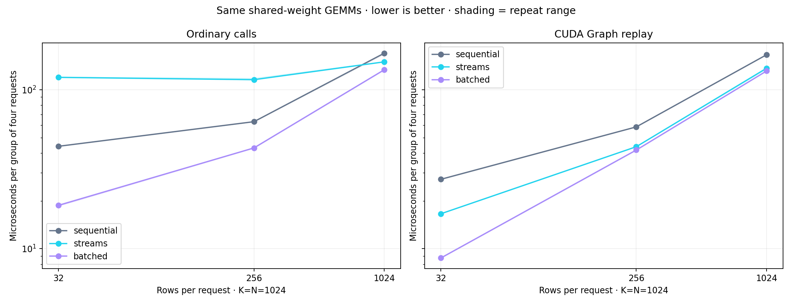

# Sequential, multiple streams, and batching

All numerical checks and independent timing audits passed. Repetitions are
separate measurement passes in one process with shuffled case order. Each group
contains four requests with the same weight matrix. Inputs are already GPU-resident
and laid out contiguously; batch assembly and queueing delay are excluded.
Times include Python submission and block completion, including CUDA Graph replay
times. These are medians of per-group block averages, not request tail latencies.

| Submission | Rows per request | Strategy | Median µs / four-request group |
| --- | ---: | --- | ---: |
| ordinary | 32 | sequential | 44.13 |
| ordinary | 256 | sequential | 63.03 |
| ordinary | 1024 | sequential | 170.05 |
| ordinary | 32 | streams | 119.80 |
| ordinary | 256 | streams | 115.83 |
| ordinary | 1024 | streams | 149.96 |
| ordinary | 32 | batched | 18.75 |
| ordinary | 256 | batched | 43.10 |
| ordinary | 1024 | batched | 133.72 |
| graph | 32 | sequential | 27.35 |
| graph | 256 | sequential | 58.43 |
| graph | 1024 | sequential | 166.23 |
| graph | 32 | streams | 16.60 |
| graph | 256 | streams | 43.85 |
| graph | 1024 | streams | 136.75 |
| graph | 32 | batched | 8.74 |
| graph | 256 | batched | 41.79 |
| graph | 1024 | batched | 131.37 |

Measured 54 cases and 16,379 blocks, covering 6,722,019 four-request groups.
