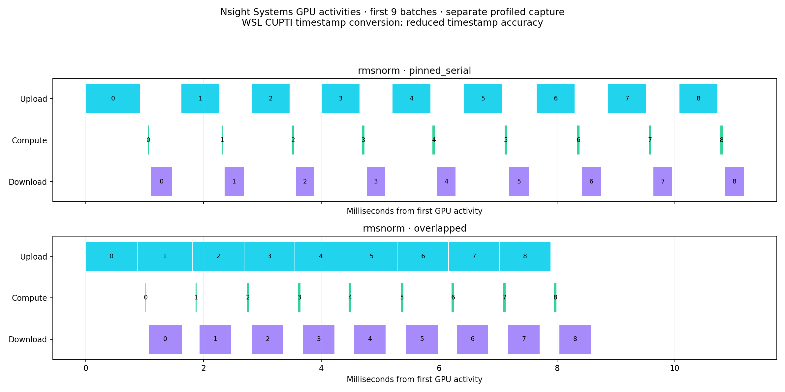
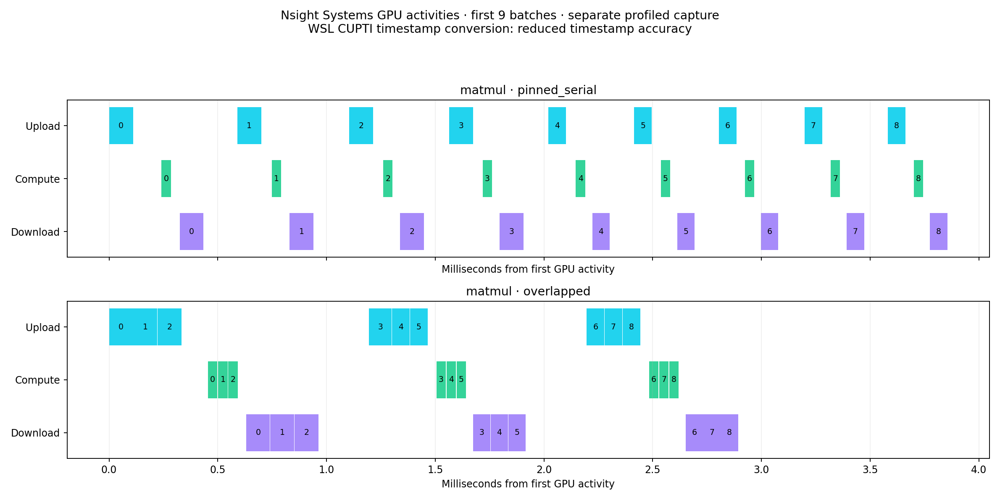
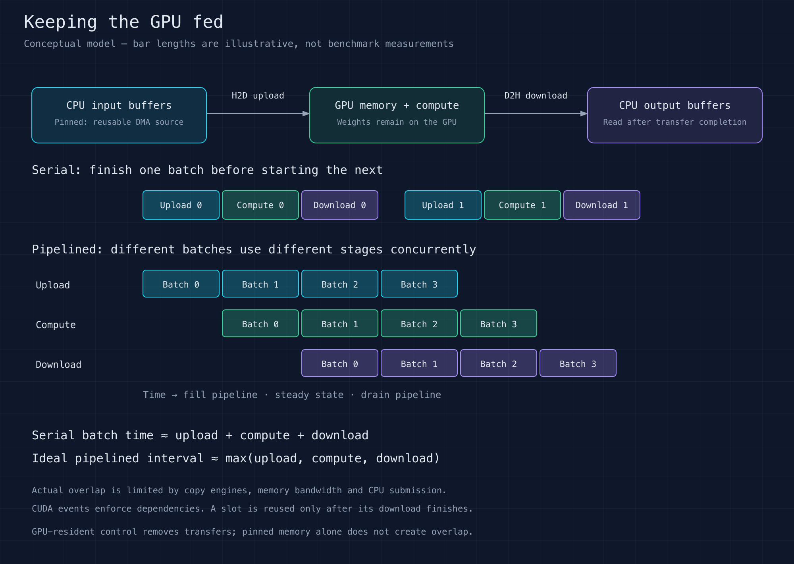

# GPU runtime and data movement: keep the GPU fed

Question: how much throughput do we lose moving batches between CPU and GPU,
and which changes recover it?

This exercise compares transfer size, pinned memory, copy batching, and a bounded
three-stream pipeline on an RTX 4070 SUPER. Workloads are compiled residual RMSNorm
and BF16 matrix multiplication. Each uses the same operation and input values
across its execution variants. The GPU-resident control omits CPU transfers and
is a different data-residency contract, not an equivalent end-to-end application.
It still includes Python submission overhead and is not a pure kernel-time ceiling.

## Measured results

Completed September 8, 2026: **105 cases, 107,468 timed blocks and 25,077,760
operations** across three repetitions. The run took 14 minutes 8 seconds,
including 13.15 minutes of timed blocks. Numerical checks and the independent
raw-sample audit passed; the executed benchmark source hash matches this repository.

| Workload | Pageable serial | Pinned serial | Pipelined | GPU resident | Pipeline / pageable |
| --- | ---: | ---: | ---: | ---: | ---: |
| RMSNorm | 322 | 856 | 1,137 | 12,638 | 3.53× |
| Matrix multiplication | 1,578 | 2,870 | 3,587 | 20,065 | 2.27× |

Values are completed batches/second, taking the median of the three repeat
medians. Pipelining improved throughput beyond pinned serial by **1.33× for
RMSNorm** and **1.25× for GEMM**. Keeping data resident gave a much larger gain,
but removes CPU input/output transfers from the workload contract.


[SVG throughput chart](results/baseline-v1/pipeline-throughput.svg)

At 256 MiB, pinned H2D reached **26.21 GB/s** versus **8.56 GB/s** pageable;
pinned D2H reached **26.45 GB/s** versus **8.24 GB/s** pageable. These are effective
payload rates, including host submission and synchronized block completion.


[SVG bandwidth chart](results/baseline-v1/transfer-bandwidth.svg)

Submitting a 4 MiB payload as one copy took **164.4 µs**, versus **672.3 µs** for
256 small copies of pre-existing contiguous views: about **4.09× less time**.
Any real application cost to pack scattered data is excluded.


[SVG batching chart](results/baseline-v1/copy-batching.svg) ·
[Full report](results/baseline-v1/report.md) ·
[CSV measurements](results/baseline-v1/timings.csv) ·
[Independent audit](results/baseline-v1/audit.json)

## Observed pipeline scheduling

Separate Nsight captures show different behavior for the two workloads. The
RMSNorm pipeline recorded compute overlapping transfers for much of its kernel
activity. The small GEMM pipeline recorded **no copy/compute overlap** in this
capture, despite its higher unprofiled throughput. Reduced synchronization and
submission overhead are plausible contributors; these captures do not isolate
that cause or prove that GEMM cannot overlap in another configuration.



[SVG RMSNorm timeline](results/baseline-v1/rmsnorm-timeline.svg)



[SVG GEMM timeline](results/baseline-v1/matmul-timeline.svg) ·
[Profiler version and compatibility record](results/baseline-v1/profiling.json)

Each panel shows the first nine batches from a separate 24-batch capture, on a
common time scale within the figure. The `overlapped` variant name describes the
requested pipeline structure, not guaranteed hardware overlap. Nsight required
a WSL timestamp-conversion workaround with reduced timestamp accuracy; the
uninstrumented benchmark remains the source for speedup claims.

For independent compute kernels, see the separate
[sequential/streams/batching study](../01_compute_streams/), whose graph-node
traces demonstrate concurrent GEMMs and compare them with one larger batched GEMM.

## Theory



[Scalable theory diagram](diagram/theory.svg)

A discrete GPU has its own memory. CPU-to-GPU (H2D) and GPU-to-CPU (D2H) copies
cross the host/device interconnect; a fast kernel does not remove that cost.
A useful first approximation is `transfer time = fixed overhead + bytes / bandwidth`.
For small payloads, submission and synchronization dominate. Large payloads reveal
the sustained transfer limit. Effective GB/s here is payload bytes divided by
synchronized wall time, not the physical link's signaling rate.

Ordinary CPU memory is pageable. Pinning keeps its pages available for DMA and
can avoid staging through another host buffer. This exercise allocates reusable
pinned buffers before timing. It does not count pinning as free application work:
one-time allocation, random input generation, and pinning costs are excluded and
not measured in this first study. Pinning immediately before every transfer can
be slower than copying directly. [PyTorch guidance](https://docs.pytorch.org/tutorials/intermediate/pinmem_nonblock.html)

`non_blocking=True` lets the CPU submit eligible work without waiting for its
completion. It does not create simultaneous GPU work by itself. Streams preserve
order within a stream; events establish dependencies across streams. Actual
copy/compute overlap requires suitable hardware, pinned memory, and independent
work. [NVIDIA best practices](https://docs.nvidia.com/cuda/cuda-c-best-practices-guide/)

For a serial batch, `T ≈ upload + compute + download`. With enough independent
batches, an ideal pipeline approaches an interval of `max(upload, compute,
download)`. That is an optimistic model: shared copy engines, memory-bandwidth
competition, CPU submission, and fill/drain overhead can prevent it. Throughput
can improve without improving the latency of an individual batch.

For example, upload=0.8 ms, compute=0.1 ms and download=0.4 ms imply 1.3 ms
serially versus an ideal 0.8 ms pipeline interval: at most about 1.6× throughput
under that model. Making the 0.1 ms kernel twice as fast saves only 0.05 ms
serially and does not change the ideal upload-limited pipeline interval. This
is why eliminating transfers can matter more than another kernel speedup.

Our pipeline rotates three slots. Upload completion releases compute; compute
completion releases download. The host waits for a slot's download before reusing
its storage. CPU output must not be consumed before completion. Inputs differ
between slots so correctness checks can detect accidental cross-slot results.

RMSNorm performs relatively little arithmetic per byte. GEMM reuses its resident
weight matrix and performs about `2 * M * N * K` operations per batch, so it may
have more computation to overlap. The first GEMM shape is 1024 × 1024 × 1024: about 2.15 billion floating-point
operations with 4 MiB of total host/device traffic, or 512 operations per
transferred byte. This ratio excludes GPU-internal memory traffic;
a larger compute-dominated GEMM is a possible follow-up if host overhead dominates.

## Experiment plan and controls

| Study | Cases | Main measurement |
| --- | --- | --- |
| Transfers | 4 KiB through 256 MiB; H2D/D2H; pageable/pinned | Effective GB/s and latency |
| Copy batching | Same 4 MiB, split into 1/16/256 pre-existing views | Cost of many submissions |
| Pipelines | RMSNorm and GEMM; four variants below | Completed batches/s |
| Separate profiling | Serial and overlapped workloads | Observed copy/compute scheduling |

The variants are pageable serial (blocking copies), pinned serial (asynchronous
copies followed by one synchronization per batch), three-stream pinned overlap,
and GPU-resident computation. The pageable-to-pipeline comparison changes both
memory type and scheduling; pinned serial provides the intermediate control.
RMSNorm and GEMM run in separate cases, never together. The pipeline overlaps
stages of different batches; it uses one compute stream and does not deliberately
run multiple GEMMs or RMSNorm kernels concurrently. “Serial” means each batch
finishes its upload, compute and download before the next batch begins.

Transfer-only tests use `non_blocking=True` for both memory types, synchronize
at block boundaries, and retain buffers until completion.

RMSNorm uploads two BF16 `[4096, 1024]` tensors (16 MiB total), downloads one
(8 MiB), and keeps its weight vector resident. GEMM uploads one BF16 `[1024, 1024]`
tensor (2 MiB), downloads one (2 MiB), and keeps the second matrix resident.
RMSNorm uses the exact sibling exercise's compiled operation; GEMM uses PyTorch
matrix multiplication. This exercise optimizes scheduling and data movement,
not the kernels themselves.

## Measurement protocol

[standard.json](configs/standard.json) specifies three repetitions with independently
shuffled case order in one process: 35 cases each, 105 total. Every case collects
at least 200 timing blocks AND five measured seconds (transfers/copy batching)
or fifteen measured seconds (pipelines). The minimum measured duration is 12.75
minutes; setup, calibration and compilation add time. Transfer blocks calibrate
toward 25 ms and hold the resulting count fixed; pipeline blocks contain 24 batches.
Every block includes final synchronization and pipeline fill/drain.

The reported median is a median of per-operation block averages. It is not
individual request latency, and p95 is not request tail latency. Charts aggregate
the three repeat medians and show their range, not a confidence interval. Fixed
seeds, source hashes, dependency versions and actual sample counts are retained.

Transfers pass exact byte checks. Every pipeline passes reference checks before
and after timing, including a wraparound count not divisible by the slot count.
RMSNorm uses an FP64 reduction reference; GEMM uses FP32 multiplication then BF16
conversion. The shared tolerance is rtol=0.02, atol=0.02 for this data-movement
study. It is not a replacement for a stricter kernel-accuracy study.

Progress and sample writes occur between cases, outside timed blocks. Occasional
SSH progress reads may still have indirect host effects. No GPU-state polling or
profiling runs alongside the throughput benchmark. Clocks are unlocked; WSL and
the display GPU remain part of the measured environment. Reused synthetic buffers
exclude disk I/O, tokenization, CPU preprocessing and real input/output consumers.
The batching study does not include packing scattered application objects.

## Reproduce

Keep this exercise beside `04_kernel_fusion` so it can import the shared operation.
Use the sibling exercise's pinned environment on the CUDA host:

```bash
cd ../04_kernel_fusion
bash setup.sh
source env.sh
cd ../01_data_movement
python src/benchmark.py --smoke --out local/smoke
python analysis/report.py local/smoke --out local/smoke-report
python src/benchmark.py --config configs/standard.json --out local/run1
python analysis/report.py local/run1 --out local/report1
```

Output run directories must be new. `COMPLETE` appears only after every case
passes. Raw block samples and profiler captures remain in ignored `local/`;
reviewed JSON summaries, audit hashes, CSVs and charts are published under `results/`.
The analysis independently checks raw durations, medians, p95, operation counts,
case uniqueness and duration/sample floors before generating charts.

For a separate instrumented CUDA-event timeline:

```bash
python src/benchmark.py --profile pinned_serial --workload matmul --out local/matmul-serial
python src/benchmark.py --profile overlapped --workload matmul --out local/matmul-overlapped
python analysis/timeline.py local/matmul-serial/timeline.json local/matmul-overlapped/timeline.json --out local/matmul-timeline
```

CUDA-event spans can include scheduling gaps between the markers. They must not
be described as hardware-engine occupancy. Nsight Systems traces can instead
show actual kernel and copy activities. Capture only the warmed region with the
CUDA profiler API; the Nsight workload follows the same pipeline path without
adding per-stage CUDA timing events; never compare instrumented timings with benchmark timings.
[Profiling guidance](https://docs.nvidia.com/nsight-systems/UserGuide/index.html)

For Nsight Systems, activate the measured Python environment and run:

```bash
bash src/profile.sh matmul pinned_serial local/nsys-matmul-serial
bash src/profile.sh matmul overlapped local/nsys-matmul-overlapped
python analysis/extract_trace.py local/nsys-matmul-serial.sqlite --workload matmul --variant pinned_serial --out local/matmul-serial-activities.json
python analysis/extract_trace.py local/nsys-matmul-overlapped.sqlite --workload matmul --variant overlapped --out local/matmul-overlapped-activities.json
python analysis/timeline.py local/matmul-serial-activities.json local/matmul-overlapped-activities.json --out local/nsys-matmul-timeline
```

Repeat with `rmsnorm` for the normalization workload. `NSYS_BIN` may select an
explicit Nsight Systems executable. The extractor requires the expected 24
kernels, 24 uploads and 24 downloads; an empty/unsupported capture fails instead
of yielding a plausible-looking chart. It exports only relative timing, stage,
batch number and transfer sizes. Raw traces and SQLite files stay private.

The CLI update is pinned in [nsight-systems.json](configs/nsight-systems.json),
including the SHA-256 of the downloaded NVIDIA package. The checksum records the
exact downloaded artifact; it is not a separately authenticated vendor signature.

A reproducible user-level CLI installation avoids changing CUDA or driver packages:

```bash
# Download the package URL recorded in configs/nsight-systems.json first.
bash src/install_nsys.sh /path/to/downloaded-NVIDIA-CLI.deb
export PATH="$HOME/.local/bin:$PATH"
nsys --version
```

The installer checks the recorded SHA-256, extracts under the user's `.local/opt`,
and updates the `.local/bin/nsys` symlink. The prior system package remains available
at its original path. Persist the PATH entry in the user's shell configuration
when this should become the default CLI.

### WSL profiling compatibility

Nsight Systems was upgraded from 2022.4.2 to **2026.4.1.191**, installed under the
user's tools directory and selected as the default `nsys`. The Windows GPU driver
remained 591.74. Initial captures completed but contained only CUDA API events,
without GPU kernel/copy activity tables. Explicit software tracing had the same
symptom; those captures are not treated as evidence of GPU overlap.

[NVIDIA's WSL workaround](https://forums.developer.nvidia.com/t/nsys-doesnt-show-cuda-kernel-and-memory-data/315536/9)
sets `CuptiUseRawGpuTimestamps=false` in the configuration reported by `nsys -z`.
`python src/configure_nsys_wsl.py` applies that setting while preserving other
configuration and backing up an existing file. This restored GPU activity records.
It uses CUPTI timestamp conversion with **reduced timestamp accuracy**. The
workaround applies to the separate profiler captures, not the unprofiled benchmark.
Do not infer tiny overlap intervals or precise microsecond differences from these
traces. The capture wrapper now rejects exports missing GPU activity tables.
