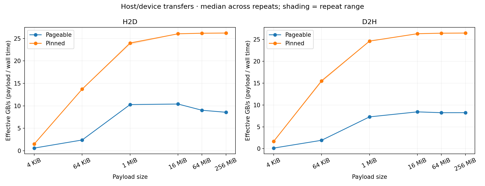
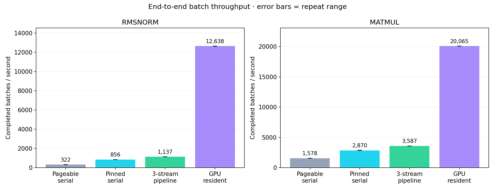
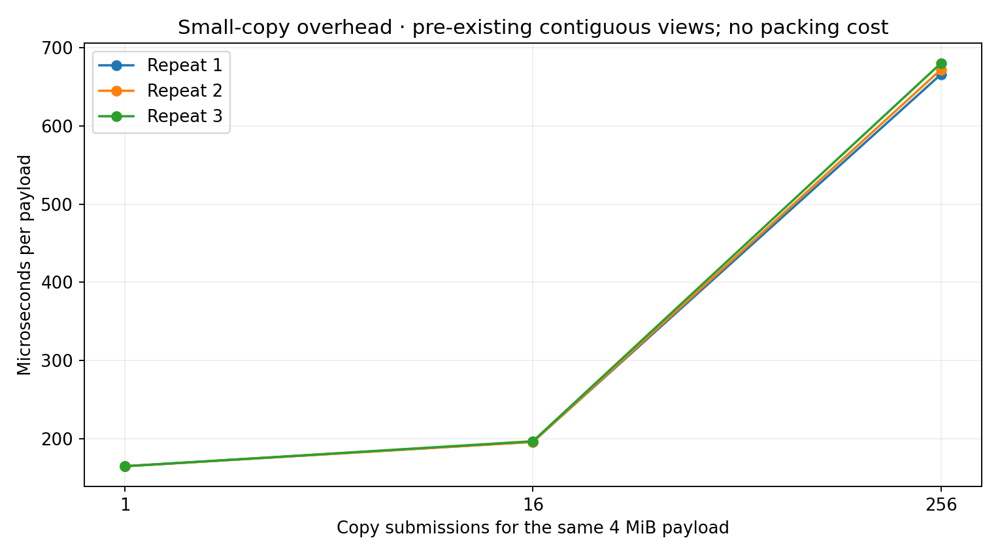

# Data movement results

All numerical checks and independent timing audits passed. Repetitions are
separate measurement passes in one process, with independently shuffled case order.
Error bars show the range of repeat medians, not confidence intervals.

| Workload | Pageable serial batches/s | Pinned serial | Overlapped | GPU resident | Overlapped / pageable |
| --- | ---: | ---: | ---: | ---: | ---: |
| rmsnorm | 322.0 | 855.6 | 1,136.7 | 12,637.5 | 3.53× |
| matmul | 1,578.0 | 2,869.8 | 3,586.9 | 20,065.2 | 2.27× |

Measured 105 cases, 107,468 timed blocks, and
25,077,760 operations (a transfer payload or a pipeline batch).
Total timed-block duration: 13.15 minutes.

See the exercise README for theory, protocol, reproduction commands and limitations.
