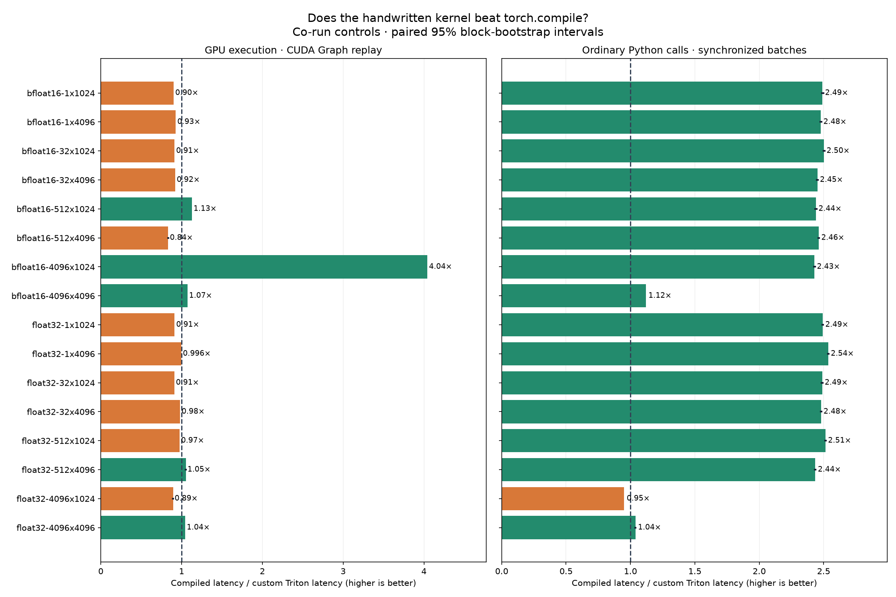
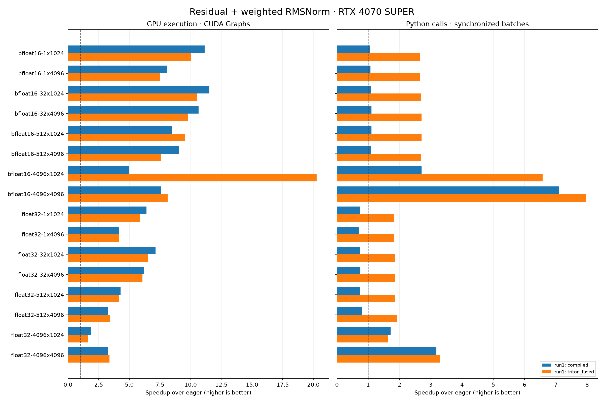
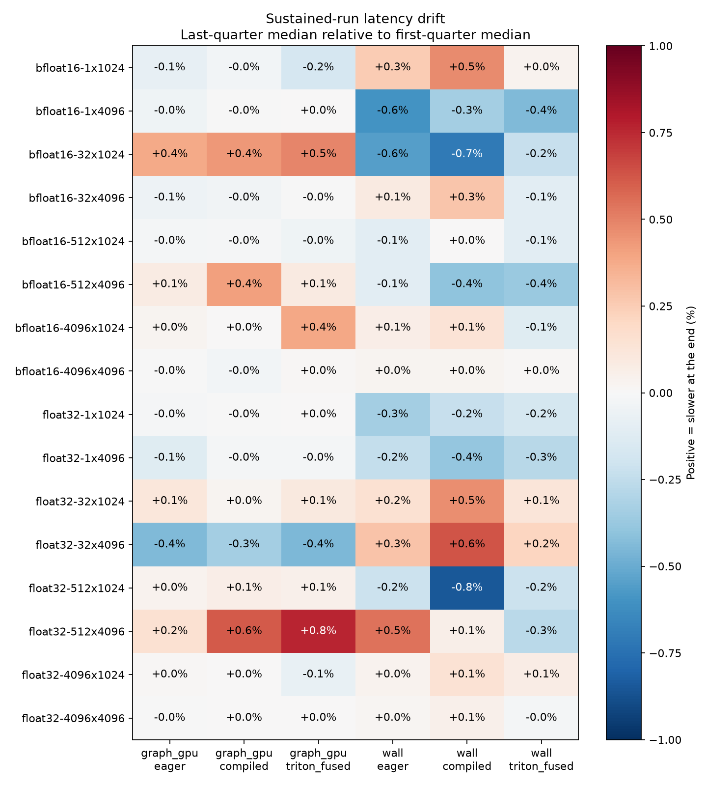
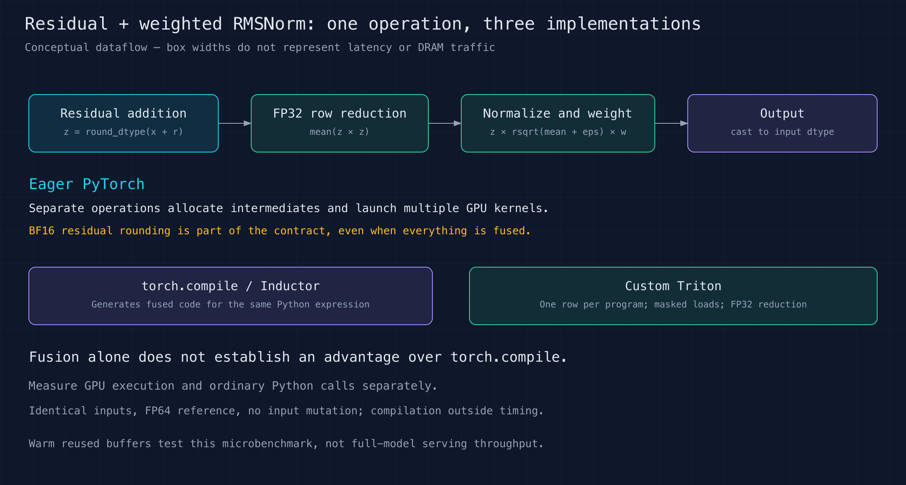
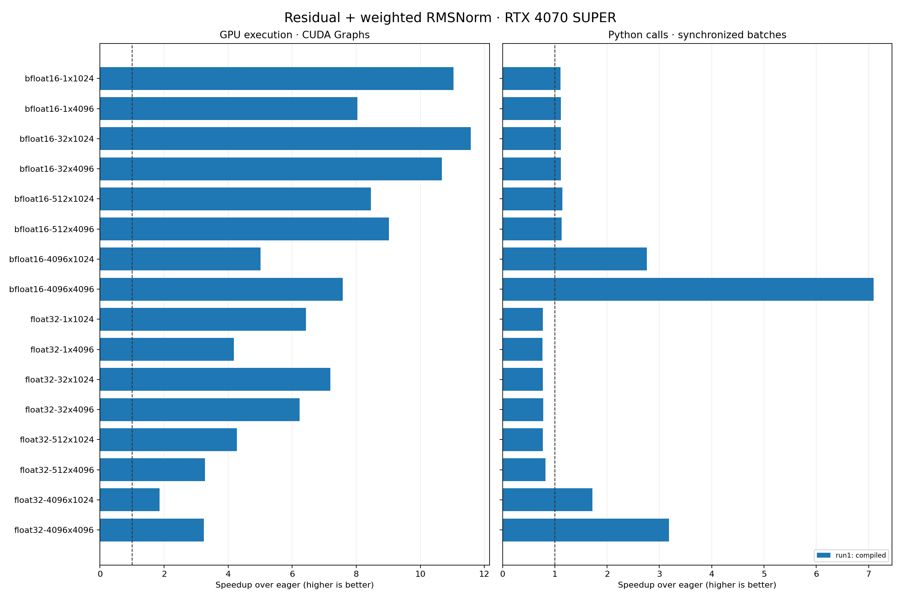
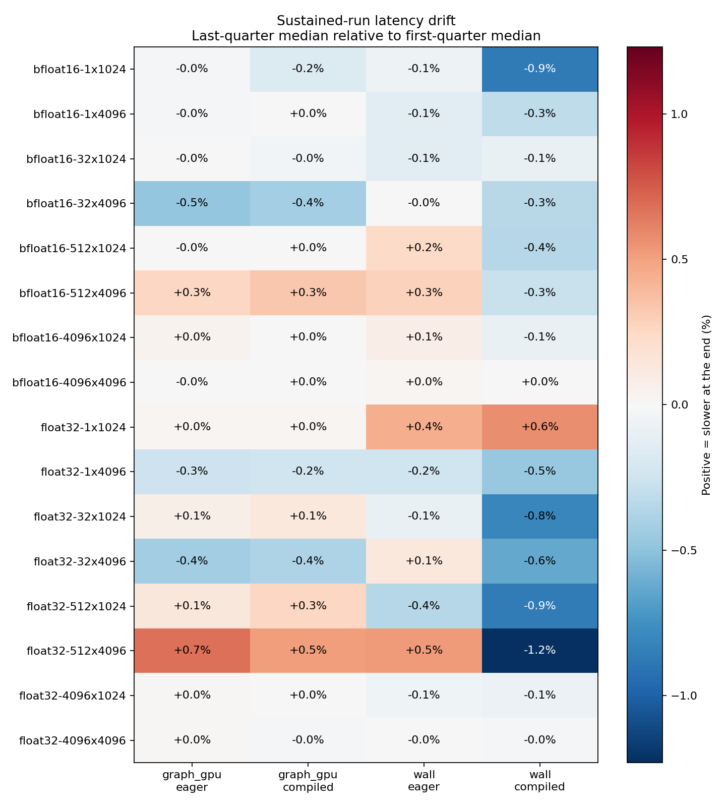
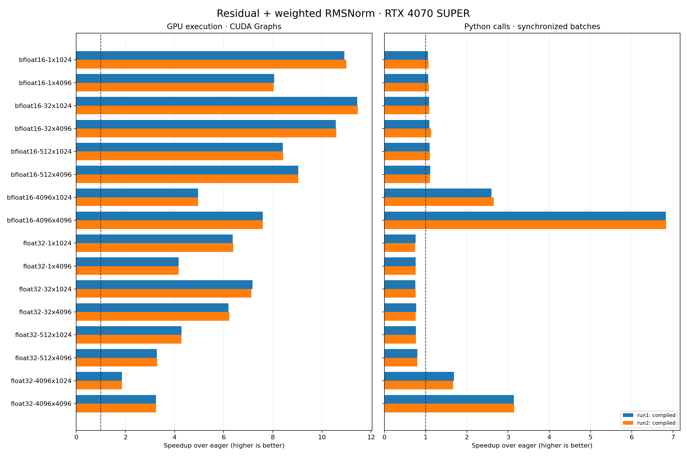

# Residual + RMSNorm kernel fusion

Question: how much can a custom Triton kernel improve a transformer normalization
operation over eager and compiled PyTorch on an RTX 4070 SUPER?

Status: **custom Triton comparison complete**, September 8, 2026. All 16 cases
passed correctness and independent sample audits. Historical baselines below
remain unchanged.

## Measured custom-kernel results

The three-method run collected **214,164 timed samples and 504,486,459 operation
calls**, with **2,064–2,481 samples per method/timing pair in each case**. It ran
for 58.28 elapsed minutes, including 55.43 minutes of measured batches.

| Comparison | GPU speedup range | GPU faster cases | Python-call speedup range | Python faster cases |
| --- | ---: | ---: | ---: | ---: |
| Custom Triton over eager | 1.67–20.26× | 16/16 | 1.63–7.95× | 16/16 |
| Custom Triton over compiled | 0.835–4.04× | 5/16 | 0.951–2.54× | 15/16 |

Values below 1 mean a regression. These are co-run comparisons, not ratios against
the earlier baseline. Paired block-bootstrap intervals support the directions
within this run, but do not establish cross-day reliability or practical importance
for tiny differences.



[SVG](results/triton-v1/versus-compiled.svg) ·
[Direct comparison and confidence intervals](results/triton-v1/versus-compiled.csv) ·
[Full report](results/triton-v1/report.md)

The strongest GPU result is BF16 `[4096, 1024]`: **182.26 µs eager, 36.37 µs
compiled, 9.00 µs custom**. Python-call medians are 187.36, 69.16 and 28.49 µs,
respectively. A counterexample is BF16 `[512, 4096]`: compiled GPU execution takes
5.86 µs versus 7.02 µs custom, even though the custom Python-call path is faster.
The custom kernel improves dispatch overhead much more consistently than device
execution; the two timing modes must not be combined into one speedup.

Separate profiling confirms **10 eager kernels versus one compiled and one custom
kernel** in both checked BF16 shapes. Both optimized implementations are already
fused. The fourfold difference at `[4096, 1024]` needs hardware-counter profiling
to explain; this study does not claim a measured reduction in DRAM traffic.



[SVG](results/triton-v1/speedups.svg) · [Kernel counts](results/triton-v1/profile.json)

The largest first-quarter/last-quarter median drift was **0.85%** across 96
method/metric/case combinations. This is one sustained process run. Occasional
SSH progress reads and a pre-existing GPU monitor were present; indirect observer
effects were not isolated. These warm-buffer measurements are not end-to-end
transformer throughput, and clocks were not locked.



[SVG](results/triton-v1/stability.svg) · [Audited run metadata](results/triton-v1/run1/)

## Custom Triton implementation

[triton_rmsnorm.py](src/triton_rmsnorm.py) loads one row per program, adds the
residual, explicitly rounds to the input dtype, reduces squared values in FP32,
normalizes, applies the learned scale and writes the final output. Intermediates
stay within the kernel. The initial launch uses four warps for widths up to 4096
and eight for larger supported widths; it is a fixed heuristic, not an autotuned
winner. FP contraction is disabled to preserve the expression's rounding order.

The wrapper accepts contiguous two-dimensional CUDA FP32/BF16 inputs with width
1–8192, a matching residual and a one-dimensional weight. It rejects autograd
inputs and unsupported layouts. It returns a fresh output without modifying inputs.



[SVG diagram](diagram/fusion.svg)

[Extended numerical checks](results/triton-check.json) cover 48 cases: random,
zero, cancellation and small-magnitude inputs; both dtypes; widths 1, 33, 1000,
1024, 4096 and 8192. Unsupported strided/autograd inputs are rejected. The timing
harness additionally checks all measured shapes against the same FP64 oracle,
including CUDA Graph replay. These checks do not cover arbitrary numerical extremes.

Run all three methods with the unchanged long-run protocol:

```bash
python src/check_triton.py
python src/benchmark.py --config configs/long.json --methods eager compiled triton_fused --out local/fusion1
python analysis/verify_run.py local/fusion1
python analysis/report.py local/fusion1 --out local/fusion-report
python analysis/compare_compiled.py local/fusion1 --out local/fusion-report
python analysis/stability.py local/fusion1 --out local/fusion-report
# After timing finishes:
python analysis/profile_kernels.py --methods eager compiled triton_fused --out local/fusion-profile.json
```

Three methods × two timing modes × 16 cases × 30 measured seconds gives a
48-minute measured floor, plus setup and overhead. A custom kernel is not
guaranteed to beat Inductor's already-fused implementation; compare against the
co-run compiled control as well as eager PyTorch. Kernel counts alone do not
establish lower memory traffic or explain a latency difference.

Reference: [Triton row-reduction tutorial](https://triton-lang.org/main/getting-started/tutorials/05-layer-norm.html).

The direct-comparison confidence intervals and drift chart require the retained
raw samples to regenerate. The general report can be regenerated from the
published compact `results/triton-v1/run1` directory. A later tuning run should
keep both controls and preserve this fixed-launch kernel as the first custom
baseline. Further optimization and Nsight Compute explanation remain follow-ups.

## Sustained eager/compiled baseline (v2)

Completed September 8, 2026.
The sustained run covered 16 cases with **2,000–2,212 samples per method and timing
mode**, totaling **137,040 timed samples and 270,771,482 operation calls**.
Correctness and the independent result audit passed.

[Full sustained baseline report](results/baseline-v2/report.md) ·
[CSV timings](results/baseline-v2/timings.csv) ·
[SVG comparison](results/baseline-v2/speedups.svg)



GPU execution improved in all 16 cases, by **1.86–11.58×**. Ordinary Python-call
speedups ranged from **0.76× to 7.09×**, improving in 10 of 16 cases; six FP32
cases regressed despite faster GPU execution. These are warm-cache operation
microbenchmarks, not end-to-end model speedups.

The run took **38.67 minutes**, including **36.55 minutes of measured batches**.
The largest absolute change between first-quarter and last-quarter median latency
was **1.23%** across the 64 case/method/timing combinations. This describes drift
within this run; it does not establish repeat-run variability or zero observer effect.



[SVG drift chart](results/baseline-v2/stability.svg) ·
[CSV drift measurements](results/baseline-v2/stability.csv)

## Initial exploratory baseline (v1)

Two independent runs × 16 cases × 40 rounds per method and timing mode passed
correctness and result audits. GPU speedups were **1.86–11.44×** in run 1;
Python-call speedups were **0.75–6.83×**. The runs' speedup ratios differed by at
most 0.8% for GPU timing and 3.8% for Python timing.



[Initial report](results/baseline-v1/report.md) ·
[CSV timings](results/baseline-v1/timings.csv) ·
[SVG comparison](results/baseline-v1/speedups.svg)

Separate profiling found 10 eager GPU kernels versus 1 compiled kernel in both
checked BF16 shapes. See [profile counts](results/baseline-v1/profile.json).

Verified: Python 3.12.3, PyTorch 2.13.0+cu130, Triton 3.7.1, CUDA runtime 13.0,
RTX 4070 SUPER (compute capability 8.9), host NVIDIA driver 591.74. Dependency
consistency (`pip check`), handwritten Triton FP32/FP16/BF16 addition, and
full-graph `torch.compile` all passed. See [verification results](results/environment-check.json)
and [resolved package versions](requirements.lock.txt).

## Setup and verification

Run from this directory on a Linux CUDA host with Python 3.12, a compatible NVIDIA
driver, and C/C++ compilers:

```bash
bash setup.sh
source env.sh
python src/smoke_test.py
```

Setup creates `.venv/` here, installs PyTorch 2.13.0 with CUDA 13.0 and the Triton
version required by that wheel, plus NumPy, pandas, Matplotlib, pytest, and Ninja.
`requirements.lock.txt` pins the measured dependency versions; setup installs those pins without rewriting them. Compiler caches also stay
inside this directory and are ignored by Git.

Write and review source on the development machine; copy this exercise directory
to the GPU host. Compile and execute there. No PyTorch installation is required
on the editing machine. Host addresses and SSH credentials belong in local config.

The smoke test checks CUDA availability, a handwritten Triton addition kernel in
FP32/FP16/BF16 with a masked tail, and a full-graph `torch.compile` normalization
expression on two different inputs. Results go to `results/environment-check.json`.
The first-call duration includes compilation and must not be reported as latency
of a warmed kernel. `KERNEL_CHECK_OUTPUT` can redirect the check result.

## Sustained-sampling protocol (v2)

The initial 40-round runs above are exploratory baselines. The default is now
[long.json](configs/long.json): **at least 2,000 samples AND 30 measured seconds**
for every method/timing pair in every case. Sampling continues in balanced paired
cycles until every pair meets both floors (10,000-round fail-safe).

Each method is calibrated to a roughly 15 ms sample, then its batch size stays
fixed. Actual samples, calls/sample, total calls, and measured seconds are saved.
GPU duration is CUDA-event time; Python duration is synchronized wall time.
Calibration, compilation, correctness checks and warmup are excluded. There are
100 initial warmup calls plus 2 seconds of sustained warmup per method.

For 16 cases × 2 methods × 2 timing modes, the measured-duration floor is
32 minutes, plus setup and sampling overhead. The 2,000-sample floor is 50× the
initial sample count; call counts depend on measured operation speed. Confidence
intervals use paired 50-round block bootstrap to retain short-range timing
correlation. This is still a repeated-buffer microbenchmark; longer sampling
does not turn it into an end-to-end model or streaming-memory workload.

The duration controller passed a GPU smoke check and an independent sample audit.
The audit also rejects increased duration/sample requirements that the saved
smoke run did not satisfy. The completed long-run results are preserved in
[baseline-v2](results/baseline-v2/report.md), separately from v1.

## Repeat the benchmark

Run on the GPU host with other compute workloads idle:

```bash
source env.sh
python src/benchmark.py --config configs/long.json --out local/repeat1
python src/benchmark.py --config configs/long.json --out local/repeat2
python analysis/verify_run.py local/repeat1
python analysis/verify_run.py local/repeat2
python analysis/report.py local/repeat1 local/repeat2 --out local/repeat-report
python analysis/profile_kernels.py --out local/repeat-profile.json
```

Output directories must not already exist. A run writes `COMPLETE` only after
all cases pass. Run the profiler after timing is finished so it does not compete
with measurements. Original numeric samples stay under ignored `local/`; this
repository includes reviewed manifests, summaries, audits, CSV, and charts.
The report can also be regenerated from the published `results/baseline-v2/run1`
directory. Raw samples are needed for the independent audit and drift analysis.

The [long-run configuration](configs/long.json) freezes seeds, epsilon, shapes, dtypes,
warmup, rounds, batching, and correctness tolerances. Every run records its exact
configuration, source hashes, environment and GPU-state snapshots. Compilation
and graph capture are outside timing. GPU timing uses identical CUDA Graph
capture for both methods; Python timing uses ordinary calls. All p95 values are
**p95 of per-call batch averages**, not per-request tail latency.

## Operation and extension contract

`src/implementations.py` defines the operation: add the residual in input dtype,
round that sum to input dtype, normalize and multiply by the weight in FP32, then
cast the normalized result back to input dtype. It returns only that result and
must not modify inputs. This weighted operation is more complete than the
unweighted setup smoke test. Forward inference, contiguous tensors, fixed shapes,
and finite random/zero inputs are the current scope.

To evaluate a later kernel, add a factory branch to `implementations.build` and
run it beside both controls:

```bash
python src/benchmark.py --methods eager compiled triton_fused --out local/fusion1
```

Keep the operation contract and protocol fixed. Each implementation passes the
same FP64-reference and input-immutability checks before timing. Preserve earlier
run directories; publish a new results directory for each optimization. A changed
implementation has a new source hash. Repeat-run reports deliberately require
matching configurations and source hashes; compare optimizations using the
co-run eager/compiled controls and retain environment differences in the report.

The harness measures compilation/first-call time separately, but compiler caches
are persistent, so that number is not a controlled cold-compilation benchmark.
GPU clocks are unlocked and WSL shares the display GPU. Warm reused inputs may
fit in cache at small shapes; streaming-memory and end-to-end model tests remain
future work.

## Observer overhead

Elapsed-time checks, sample writes, and progress updates happen between timed
batches, after synchronization. They are excluded directly from per-call timing,
but can alter overall duty cycle or compete for host resources. SSH status reads
and GPU driver queries are also potential indirect disturbances, particularly
for the Python wall-clock metric. The published sustained run was checked
occasionally over SSH; GPU-state polling was stopped during the remaining
measurements after discussing observer overhead. No claim of zero observer
effect is made. A logging-disabled, unobserved repeat would be needed to measure
that effect directly.
