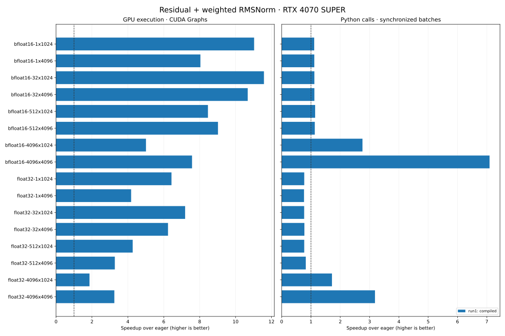

# Eager versus compiled residual + RMSNorm

## Question and prediction

Does Inductor compilation reduce warmed execution time for residual addition, RMS normalization, and learned scaling? Fewer launches and intermediate memory transfers should help, particularly on small workloads.

## Workload and environment

NVIDIA GeForce RTX 4070 SUPER; PyTorch 2.13.0+cu130; Triton 3.7.1; CUDA 13.0; driver 591.74; Python 3.12.3. CPU: AMD Ryzen 7 5800X 8-Core Processor. Linux/WSL, one PyTorch CPU thread. GPU clocks were not locked.

Forward inference only; contiguous row-major inputs; FP32 and BF16; residual addition rounds to input dtype before normalization; FP32 accumulation and scaling; output returns to input dtype. Only the normalized output is returned. This includes residual addition and weight scaling, not standalone RMSNorm.

## Method

1 independent process runs, 16 cases each, seed 20260908. Each method receives the same inputs, 100 warmup calls, and at least 2000 measured rounds. Method order is randomized with balanced first/second positions; case order is deterministically shuffled. Inputs and allocations are reused across rounds (warm-cache microbenchmark).

At least 2,000 rounds AND 30 measured seconds per method/timing pair per case. Batches are calibrated once per method toward 15 ms, then held fixed. Additional warmup: 2 seconds per method. Final round counts, batch calls and measured durations are recorded in summaries. Confidence intervals use paired circular block bootstrap with 50-round blocks to preserve short-range timing correlation.

GPU timing uses CUDA events around repeated replay of a graph containing 32 calls, divided by all replayed calls. Python timing uses a synchronized batch of ordinary calls divided by batch size. Graph capture, calibration and compilation are excluded. Automatic compiler CUDA Graphs are disabled so graph treatment is matched between implementations.

Median and p95 below are distributions of **per-call batch averages**, not individual-request tail latency. Bootstrap confidence intervals in summaries resample paired rounds and describe within-run variability only. First-call durations are saved separately and may hit existing compiler caches; they are not cold compilation benchmarks.

Correctness: three random input seeds plus zeros for every method/shape, checked against an independent FP64 reduction with explicit dtype tolerances; input immutability, output dtype/shape, and captured-graph output are checked. These tests cover the benchmark inputs, not all possible numerical extremes.

## Results



### run1

| Case | Method | GPU eager µs p50 / p95 | GPU method µs p50 / p95 | GPU speedup | Python eager µs p50 / p95 | Python method µs p50 / p95 | Python speedup |
|---|---|---:|---:|---:|---:|---:|---:|
| bfloat16-1x1024 | compiled | 10.13 / 10.19 | 0.92 / 0.92 | 11.03× | 74.44 / 76.59 | 67.02 / 69.35 | 1.11× |
| bfloat16-1x4096 | compiled | 10.57 / 10.61 | 1.31 / 1.32 | 8.04× | 74.16 / 75.52 | 66.57 / 68.14 | 1.11× |
| bfloat16-32x1024 | compiled | 12.02 / 12.07 | 1.04 / 1.04 | 11.58× | 74.20 / 76.03 | 66.46 / 68.02 | 1.12× |
| bfloat16-32x4096 | compiled | 16.30 / 16.36 | 1.53 / 1.53 | 10.68× | 75.34 / 76.80 | 67.46 / 69.34 | 1.12× |
| bfloat16-512x1024 | compiled | 20.57 / 20.58 | 2.43 / 2.44 | 8.46× | 75.02 / 76.64 | 65.66 / 67.44 | 1.14× |
| bfloat16-512x4096 | compiled | 53.60 / 56.34 | 5.94 / 6.29 | 9.02× | 75.58 / 77.06 | 66.84 / 68.92 | 1.13× |
| bfloat16-4096x1024 | compiled | 182.19 / 182.51 | 36.37 / 36.38 | 5.01× | 188.03 / 189.28 | 68.17 / 69.82 | 2.76× |
| bfloat16-4096x4096 | compiled | 1691.84 / 1710.05 | 223.34 / 224.91 | 7.58× | 1724.55 / 1744.97 | 243.10 / 246.76 | 7.09× |
| float32-1x1024 | compiled | 6.27 / 6.32 | 0.97 / 0.98 | 6.43× | 51.35 / 53.55 | 66.63 / 70.15 | 0.77× |
| float32-1x4096 | compiled | 6.65 / 6.70 | 1.59 / 1.60 | 4.18× | 51.04 / 51.97 | 66.86 / 68.56 | 0.76× |
| float32-32x1024 | compiled | 7.96 / 7.99 | 1.11 / 1.11 | 7.19× | 51.36 / 52.85 | 66.88 / 69.85 | 0.77× |
| float32-32x4096 | compiled | 12.07 / 12.08 | 1.93 / 1.94 | 6.24× | 52.10 / 53.23 | 67.15 / 68.99 | 0.78× |
| float32-512x1024 | compiled | 15.26 / 15.29 | 3.57 / 3.59 | 4.27× | 50.83 / 52.10 | 65.99 / 68.47 | 0.77× |
| float32-512x4096 | compiled | 42.29 / 43.49 | 12.91 / 13.40 | 3.27× | 54.83 / 56.27 | 66.62 / 68.85 | 0.82× |
| float32-4096x1024 | compiled | 185.82 / 186.11 | 99.72 / 99.77 | 1.86× | 193.99 / 196.39 | 113.01 / 115.70 | 1.72× |
| float32-4096x4096 | compiled | 1470.21 / 1486.14 | 452.77 / 454.82 | 3.25× | 1495.27 / 1512.54 | 469.56 / 475.95 | 3.18× |

## Run duration

| Run | Timestamp-to-timestamp elapsed minutes | Sum of measured batch minutes |
|---|---:|---:|
| run1 | 38.67 | 36.55 |

Elapsed timestamps include recorded setup, calibration, checks, reporting and gaps; measured totals sum the distinct timed batches. Process imports before the start timestamp are not included.

## Actual sampling totals

| Run | Case | Metric | Method | Samples | Calls/sample | Total calls | Measured seconds |
|---|---|---|---|---:|---:|---:|---:|
| run1 | bfloat16-1x1024 | graph_gpu | eager | 2176 | 1376 | 2,994,176 | 30.34 |
| run1 | bfloat16-1x1024 | graph_gpu | compiled | 2176 | 15008 | 32,657,408 | 30.00 |
| run1 | bfloat16-1x1024 | wall | eager | 2176 | 201 | 437,376 | 32.70 |
| run1 | bfloat16-1x1024 | wall | compiled | 2176 | 223 | 485,248 | 32.67 |
| run1 | bfloat16-1x4096 | graph_gpu | eager | 2186 | 1312 | 2,868,032 | 30.34 |
| run1 | bfloat16-1x4096 | graph_gpu | compiled | 2186 | 10432 | 22,804,352 | 30.01 |
| run1 | bfloat16-1x4096 | wall | eager | 2186 | 202 | 441,572 | 32.80 |
| run1 | bfloat16-1x4096 | wall | compiled | 2186 | 222 | 485,292 | 32.41 |
| run1 | bfloat16-32x1024 | graph_gpu | eager | 2212 | 1152 | 2,548,224 | 30.65 |
| run1 | bfloat16-32x1024 | graph_gpu | compiled | 2212 | 13056 | 28,879,872 | 30.01 |
| run1 | bfloat16-32x1024 | wall | eager | 2212 | 199 | 440,188 | 32.78 |
| run1 | bfloat16-32x1024 | wall | compiled | 2212 | 224 | 495,488 | 32.99 |
| run1 | bfloat16-32x4096 | graph_gpu | eager | 2188 | 864 | 1,890,432 | 30.80 |
| run1 | bfloat16-32x4096 | graph_gpu | compiled | 2188 | 8992 | 19,674,496 | 30.00 |
| run1 | bfloat16-32x4096 | wall | eager | 2188 | 195 | 426,660 | 32.22 |
| run1 | bfloat16-32x4096 | wall | compiled | 2188 | 221 | 483,548 | 32.73 |
| run1 | bfloat16-512x1024 | graph_gpu | eager | 2190 | 704 | 1,541,760 | 31.72 |
| run1 | bfloat16-512x1024 | graph_gpu | compiled | 2190 | 5632 | 12,334,080 | 30.00 |
| run1 | bfloat16-512x1024 | wall | eager | 2190 | 197 | 431,430 | 32.43 |
| run1 | bfloat16-512x1024 | wall | compiled | 2190 | 226 | 494,940 | 32.62 |
| run1 | bfloat16-512x4096 | graph_gpu | eager | 2146 | 288 | 618,048 | 33.29 |
| run1 | bfloat16-512x4096 | graph_gpu | compiled | 2146 | 2336 | 5,013,056 | 30.02 |
| run1 | bfloat16-512x4096 | wall | eager | 2146 | 196 | 420,616 | 31.86 |
| run1 | bfloat16-512x4096 | wall | compiled | 2146 | 222 | 476,412 | 31.97 |
| run1 | bfloat16-4096x1024 | graph_gpu | eager | 2042 | 96 | 196,032 | 35.74 |
| run1 | bfloat16-4096x1024 | graph_gpu | compiled | 2042 | 416 | 849,472 | 30.88 |
| run1 | bfloat16-4096x1024 | wall | eager | 2042 | 79 | 161,318 | 30.35 |
| run1 | bfloat16-4096x1024 | wall | compiled | 2042 | 215 | 439,030 | 30.03 |
| run1 | bfloat16-4096x4096 | graph_gpu | eager | 2000 | 32 | 64,000 | 108.39 |
| run1 | bfloat16-4096x4096 | graph_gpu | compiled | 2000 | 96 | 192,000 | 42.88 |
| run1 | bfloat16-4096x4096 | wall | eager | 2000 | 9 | 18,000 | 31.10 |
| run1 | bfloat16-4096x4096 | wall | compiled | 2000 | 62 | 124,000 | 30.21 |
| run1 | float32-1x1024 | graph_gpu | eager | 2194 | 2208 | 4,844,352 | 30.40 |
| run1 | float32-1x1024 | graph_gpu | compiled | 2194 | 14016 | 30,751,104 | 30.02 |
| run1 | float32-1x1024 | wall | eager | 2194 | 281 | 616,514 | 31.84 |
| run1 | float32-1x1024 | wall | compiled | 2194 | 223 | 489,262 | 32.80 |
| run1 | float32-1x4096 | graph_gpu | eager | 2198 | 2080 | 4,571,840 | 30.44 |
| run1 | float32-1x4096 | graph_gpu | compiled | 2198 | 8576 | 18,850,048 | 30.01 |
| run1 | float32-1x4096 | wall | eager | 2198 | 284 | 624,232 | 31.94 |
| run1 | float32-1x4096 | wall | compiled | 2198 | 225 | 494,550 | 33.17 |
| run1 | float32-32x1024 | graph_gpu | eager | 2192 | 1728 | 3,787,776 | 30.16 |
| run1 | float32-32x1024 | graph_gpu | compiled | 2192 | 12352 | 27,075,584 | 30.00 |
| run1 | float32-32x1024 | wall | eager | 2192 | 288 | 631,296 | 32.54 |
| run1 | float32-32x1024 | wall | compiled | 2192 | 223 | 488,816 | 32.84 |
| run1 | float32-32x4096 | graph_gpu | eager | 2184 | 1152 | 2,515,968 | 30.34 |
| run1 | float32-32x4096 | graph_gpu | compiled | 2184 | 7104 | 15,515,136 | 30.00 |
| run1 | float32-32x4096 | wall | eager | 2184 | 281 | 613,704 | 32.04 |
| run1 | float32-32x4096 | wall | compiled | 2184 | 219 | 478,296 | 32.24 |
| run1 | float32-512x1024 | graph_gpu | eager | 2184 | 992 | 2,166,528 | 33.08 |
| run1 | float32-512x1024 | graph_gpu | compiled | 2184 | 3840 | 8,386,560 | 30.00 |
| run1 | float32-512x1024 | wall | eager | 2184 | 285 | 622,440 | 31.72 |
| run1 | float32-512x1024 | wall | compiled | 2184 | 215 | 469,560 | 31.14 |
| run1 | float32-512x4096 | graph_gpu | eager | 2126 | 384 | 816,384 | 34.67 |
| run1 | float32-512x4096 | graph_gpu | compiled | 2126 | 1088 | 2,313,088 | 30.02 |
| run1 | float32-512x4096 | wall | eager | 2126 | 269 | 571,894 | 31.34 |
| run1 | float32-512x4096 | wall | compiled | 2126 | 221 | 469,846 | 31.40 |
| run1 | float32-4096x1024 | graph_gpu | eager | 2038 | 96 | 195,648 | 36.37 |
| run1 | float32-4096x1024 | graph_gpu | compiled | 2038 | 160 | 326,080 | 32.52 |
| run1 | float32-4096x1024 | wall | eager | 2038 | 77 | 156,926 | 30.50 |
| run1 | float32-4096x1024 | wall | compiled | 2038 | 130 | 264,940 | 30.00 |
| run1 | float32-4096x4096 | graph_gpu | eager | 2004 | 32 | 64,128 | 94.37 |
| run1 | float32-4096x4096 | graph_gpu | compiled | 2004 | 64 | 128,256 | 58.08 |
| run1 | float32-4096x4096 | wall | eager | 2004 | 10 | 20,040 | 30.01 |
| run1 | float32-4096x4096 | wall | compiled | 2004 | 32 | 64,128 | 30.16 |

## Interpretation and limitations

These measurements establish a local baseline for later custom kernels. The graph result isolates device execution more closely; the Python result also reflects dispatch, allocation and synchronization overhead. Neither is end-to-end model throughput. Reused inputs may fit in GPU cache for small shapes; do not extrapolate these ratios to streaming-memory workloads.

A sustained run does not establish cross-day or cross-machine reproducibility. Multiple process runs, when present, check immediate repeatability on the same machine. Windows display activity, thermal state, power management, and unlocked clocks can affect results. Per-case GPU snapshots are retained in summaries. Do not average the two timing modes together.

## Instrumentation and observer effects

Timer reads, duration-floor decisions, sample writes, and progress reporting occur outside the timed batches. They add total run time and gaps between batches. External SSH status reads can still contend for host CPU, and driver queries can disturb scheduling or power state; those indirect effects are not quantified here. Treat the Python wall-clock results as more exposed to host activity. See the exercise notes for how a published run was monitored. This is not a controlled comparison against a completely unobserved run.

## Reproduction and later optimizations

From the exercise directory on the GPU host:

```bash
source env.sh
python src/benchmark.py --config configs/long.json --out local/new-run1
python src/benchmark.py --config configs/long.json --out local/new-run2
python analysis/report.py local/new-run1 local/new-run2 --out local/new-report
```

Output directories must be new. `COMPLETE` is written only after all cases pass. Raw numeric samples stay in ignored `local/`; reviewed manifests, summaries, CSV and charts can be published. Source/configuration SHA256 values identify the measured experiment. Add later kernels through `implementations.build`, keep the operation and protocol fixed, and include both eager and compiled baselines in each new run.
