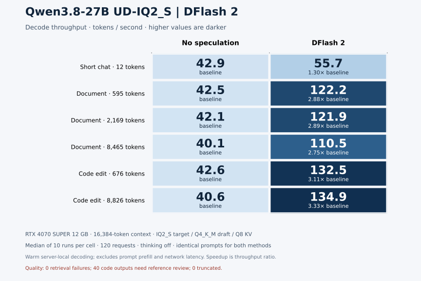

# Qwen3.8 27B DFlash 2 on CUDA

Completed 120 matched requests on an RTX 4070 SUPER. DFlash 2 decode speedups ranged from 1.30× to 3.33× across the six cases. All 60 paired outputs matched exactly. Decode speedup did not always translate into faster total requests; the long-document case regressed slightly.

[Report](notes/results-16k/report.md) · [Code review](notes/results-16k/code-review.md) · [Measured configuration](configs/measured-run.json)

Imported September 8, 2026 from the completed local experiments.

- `src/`: preserved experiment and analysis scripts.
- `notes/`: historical setup notes, findings, and reports.
- `results/`: reviewed summaries, configuration metadata, and SVG charts.

These are historical imports, not fresh reruns. Machine-specific paths and addresses were replaced with examples. Configure paths and endpoints before running the historical scripts; do not execute administration scripts without reviewing their host changes. Raw requests, generated responses, logs, model weights, build trees, and personal configuration remain outside Git. Some historical report links refer to those local captures.

The source scripts generate new raw outputs; keep these in ignored local storage and publish only reviewed summaries. Model revisions and checksums are retained where captured.

Comparison downloads: [SVG](results/results-16k/throughput-comparison.svg) · [PNG](results/results-16k/throughput-comparison.png).
