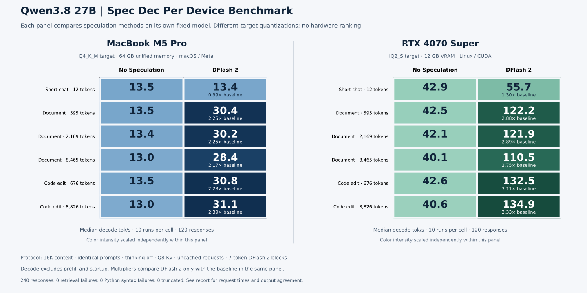

# Qwen3.8 27B DFlash 2 on Metal

Completed the corresponding 120-request Metal study and a combined report covering 240 responses. The Metal and CUDA target quantizations differ, so compare each device against its own baseline; this is not a hardware speed ranking.

[Combined report](notes/comparison/report.md) · [Measured configuration](configs/measured-run.json)

Imported September 8, 2026 from the completed local experiments.

- `src/`: preserved experiment and analysis scripts.
- `notes/`: historical setup notes, findings, and reports.
- `results/`: reviewed summaries, configuration metadata, and SVG charts.

These are historical imports, not fresh reruns. Machine-specific paths and addresses were replaced with examples. Configure paths and endpoints before running the historical scripts; do not execute administration scripts without reviewing their host changes. Raw requests, generated responses, logs, model weights, build trees, and personal configuration remain outside Git. Some historical report links refer to those local captures.

The source scripts generate new raw outputs; keep these in ignored local storage and publish only reviewed summaries. Model revisions and checksums are retained where captured.
