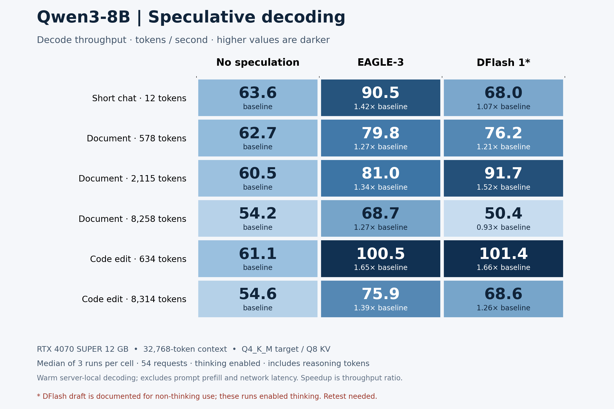
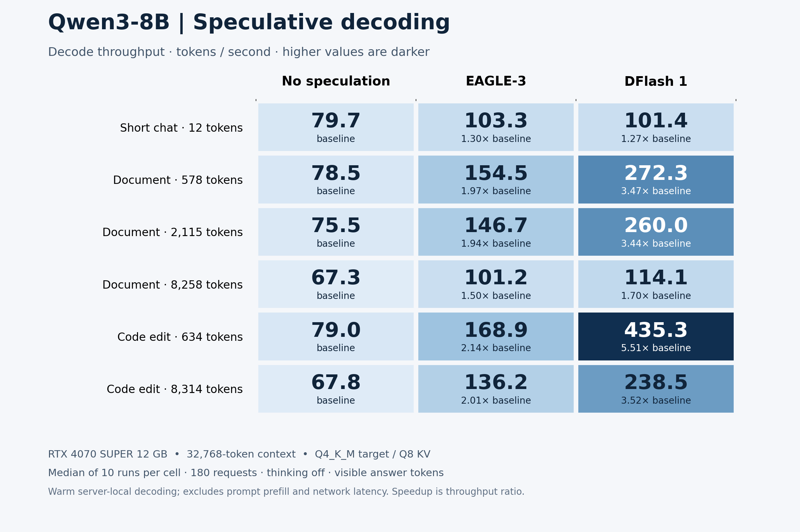

# Qwen3 8B speculative decoding

Preserves the Qwen3 8B baseline, n-gram, EAGLE-3 and DFlash studies, including initial failures, host-memory recovery, and larger repeat counts. Historical setup notes distinguish the runs and their controls.

[Experiment notes](notes/README.md) · [Ten-repeat report](notes/results-20260907T225751Z/report.md) · [Thinking-off follow-up](notes/results-20260908T010140Z/report.md)

Imported September 8, 2026 from the completed local experiments.

- `src/`: preserved experiment and analysis scripts.
- `notes/`: historical setup notes, findings, and reports.
- `results/`: reviewed summaries, configuration metadata, and SVG charts.

These are historical imports, not fresh reruns. Machine-specific paths and addresses were replaced with examples. Configure paths and endpoints before running the historical scripts; do not execute administration scripts without reviewing their host changes. Raw requests, generated responses, logs, model weights, build trees, and personal configuration remain outside Git. Some historical report links refer to those local captures.

The source scripts generate new raw outputs; keep these in ignored local storage and publish only reviewed summaries. Model revisions and checksums are retained where captured.

## Comparison charts

### Three repetitions

[SVG comparison](results/results-20260907T224213Z/throughput-comparison.svg)

### Ten repetitions

[SVG comparison](results/results-20260907T225751Z/throughput-comparison.svg)

### Thinking-off follow-up

[SVG comparison](results/results-20260908T010140Z/throughput-comparison.svg)
