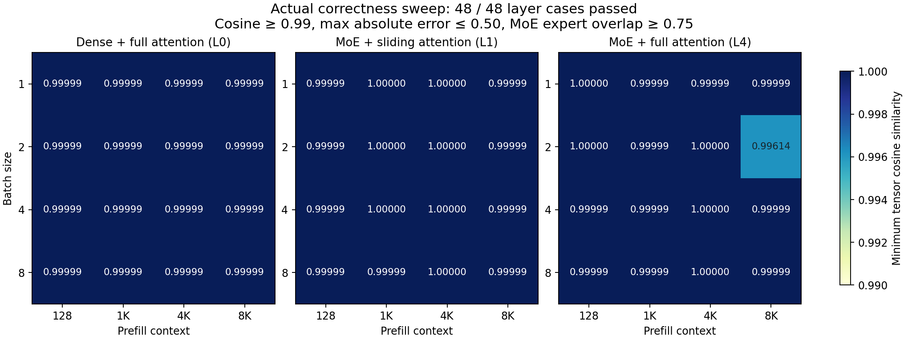
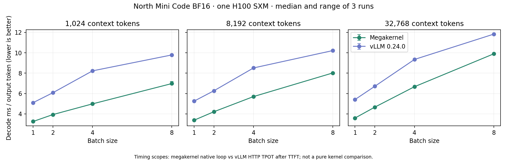
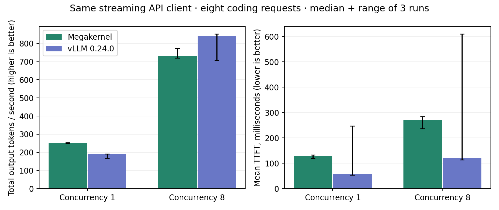
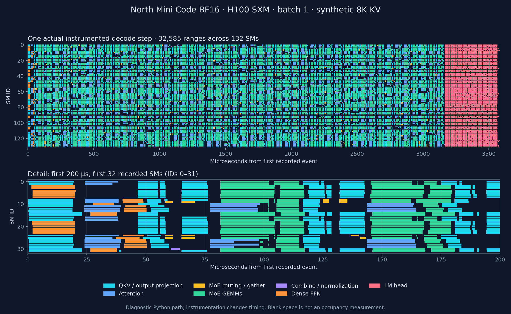
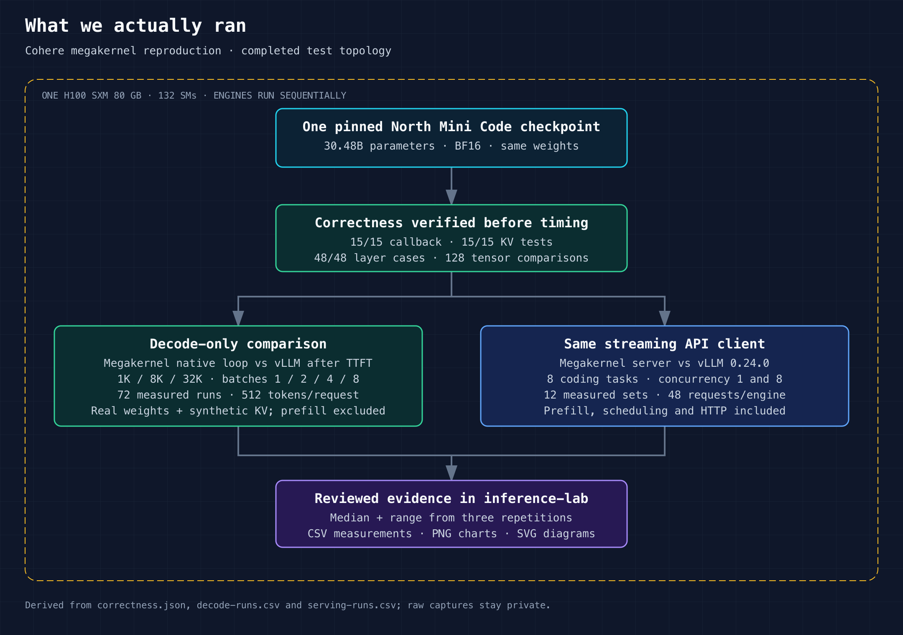

# Cohere megakernel versus vLLM on H100

This experiment tests Cohere's model-specific inference engine on one rented
H100 SXM 80 GB, using the full **North Mini Code 1.0** BF16 checkpoint
(30.48B total parameters, approximately 3B active). The baseline is **vLLM
0.24.0 with FlashAttention-3 and Triton MoE**, running the same weights and
precision on the same GPU. Neither engine uses speculative decoding or
quantization. The original consumer-GPU target cannot run this Hopper-specific
release.

**Measured outcome:** megakernel wins the decode comparison by **1.20×–1.65×**.
With the same streaming chat client, it delivers **1.31×** the throughput at
concurrency 1, but **0.87×** at concurrency 8, and has higher median TTFT at
both levels. The release's decode advantage reproduced in our tested range;
an end-to-end advantage did not hold for both of our serving workloads.

## What the upstream repo is arguing

[Cohere's release](https://github.com/cohere-ai/cohere-megakernel/tree/67d0b9ca22ea3652796b715d1d1863459e0e2c3c)
is a research serving engine built around a persistent decode kernel. Its
central idea is to schedule small GEMM tiles and attention splits across
resident thread blocks, using explicit dependency counters. Ready work can
start before an entire preceding operation finishes. This aims to reduce
operation-boundary gaps, fill partial waves, and overlap weight prefetch with
activation dependencies.

The host builds a model-specific task schedule; one block per SM executes that
schedule for a decode step. A native C++ loop drives successive steps, while
Python handles admission and ordinary PyTorch/FlashAttention prefill. Prefill
currently pauses decode. The initial embedding lookup and RMSNorm, sampling,
and cache housekeeping remain outside the fused decode body. This is a tuned
H100/SM90a, BF16, batch-1–8 implementation for North Mini Code, rather than a
portable replacement for every inference workload.

The upstream README reports 1.58× decode speedup at batch 1 and 8K context,
and 1.25–1.41× end-to-end gains on its task suites. Those are **upstream
claims**, not measurements from this exercise. Our sweep checks three context
lengths through 32K; our serving test uses a small public coding fixture. We do
not reproduce the upstream 256K sweep, SciCode/LiveCodeBench accuracy scores,
or its named end-to-end benchmark suites.

## What we verified

The release built on H100 and passed **15/15 token-callback tests, 15/15
KV-binding tests, and all 48 upstream layer cases**. The layer sweep covers
batches 1, 2, 4, 8 and contexts 128, 1K, 4K, 8K for layer 0 (dense/full
attention), layer 1 (MoE/sliding window), and layer 4 (MoE/full attention).
Across 128 tensor comparisons, the lowest cosine similarity was **0.996137**,
the largest absolute error **0.11914**, and the lowest expert overlap **0.938**.
The original thresholds—cosine ≥ 0.99, absolute error ≤ 0.50, expert overlap
≥ 0.75—were retained.



[SVG](results/correctness-comparison.svg) · [48 case measurements](results/correctness-cases.csv) · [Test summary](results/correctness.json)

These checks establish agreement within the upstream tolerances for the tested
layers and shapes. They do not establish bitwise equality, full-model output
equivalence, or code-task accuracy. The lowest-similarity case was layer 4 at
batch 2 and 8K context; it passed without changing the tolerance.

## Decode results

Across the 12 tested shapes, the median decode comparison favors megakernel by
**1.20×–1.65×**. At 8K and batch 1, megakernel reaches approximately **296
tokens/s**, versus **190 tokens/s** for vLLM: **1.55×**, close to the upstream
1.58× claim. At 8K/batch 8, the gain is **1.27×**; at 32K/batch 8, it falls
to **1.20×**. These results support a decode benefit for the tested envelope,
with a benefit that varies by batch and context.

| Context | Batch | Megakernel ms/token | vLLM ms/token | Speedup |
|---:|---:|---:|---:|---:|
| 1,024 | 1 | 3.258 | 5.104 | 1.57× |
| 1,024 | 2 | 3.935 | 6.080 | 1.54× |
| 1,024 | 4 | 4.987 | 8.226 | 1.65× |
| 1,024 | 8 | 6.977 | 9.786 | 1.40× |
| 8,192 | 1 | 3.381 | 5.253 | 1.55× |
| 8,192 | 2 | 4.214 | 6.269 | 1.49× |
| 8,192 | 4 | 5.702 | 8.511 | 1.49× |
| 8,192 | 8 | 8.018 | 10.215 | 1.27× |
| 32,768 | 1 | 3.597 | 5.412 | 1.50× |
| 32,768 | 2 | 4.667 | 6.713 | 1.44× |
| 32,768 | 4 | 6.670 | 9.344 | 1.40× |
| 32,768 | 8 | 9.894 | 11.828 | 1.20× |



[SVG](results/decode-comparison.svg) · [72 measured runs](results/decode-runs.csv) · [Median and range](results/decode-summary.json)

**Scope matters:** the megakernel number times its synchronized native C++ loop;
vLLM's number is client-observed time per output token after TTFT. The ratio
includes differences in serving overhead and is not a pure kernel speedup.

## End-to-end serving results

| Concurrency | Megakernel tok/s | vLLM tok/s | Throughput speedup |
|---:|---:|---:|---:|
| 1 | 250.5 | 190.6 | 1.31× |
| 8 | 730.3 | 842.7 | 0.87× |

| Concurrency | MK TTFT ms | vLLM TTFT ms | MK TPOT ms | vLLM TPOT ms |
|---:|---:|---:|---:|---:|
| 1 | 127.9 | 56.6 | 3.48 | 5.04 |
| 8 | 269.3 | 119.7 | 9.79 | 8.93 |



[SVG](results/serving-comparison.svg) · [12 measured sets](results/serving-runs.csv) · [96 request measurements](results/serving-requests.csv) · [Summary with ranges](results/serving-summary.json)

Both engines completed all 48 measured requests, with identical prompt-token
counts for every paired request and exactly 256 output tokens per request
(12,288 per engine). Output length therefore does not explain the throughput
difference. Generated code and reasoning were not graded.

At concurrency 1, faster output generation outweighed megakernel's higher
TTFT. At concurrency 8, megakernel's median throughput was about 13% lower than
vLLM's. The three-run throughput ranges overlap at concurrency 8, and vLLM's
first measured set had much higher TTFT than later sets. We retain every
measured repetition and show the range; this small experiment does not establish
a universal serving ranking.

The synthetic decode sweep and real-prompt serving test exercise different KV
values, expert routes, request admission, and prefill. Our measurements do not
isolate which factor caused the concurrency-8 reversal. The SM trace below is
illustrative evidence from another decode run, not a causal ablation of this
serving result.

## An actual SM schedule from this run



[SVG](results/sm-timeline.svg) · [Reviewed trace summary](results/profile-summary.json) · [Plot generator](analysis/profiler_plot.py)

A separate, instrumented batch-1/8K decode step recorded **32,585 ranges across
all 132 SMs**, spanning **3.585 ms**. The lower panel shows the first 200 µs on
SMs 0–31. Around 80–100 µs, attention and MoE GEMM ranges appear on different
SMs at the same time: a concrete view of operations interleaving within the
persistent kernel. The final pink region is the vocabulary projection (LM head).

The profiler's paired CUDA-event measurements were **3.420 ms without
instrumentation** and **3.616 ms with instrumentation**, a **5.73% increase**.
This diagnostic uses the Python-driven path, separately from the C++ decode
benchmark. Its timing does not enter any performance table above. Recorded
ranges come from the kernel's instrumentation; blank space is not a measured
occupancy or idle-time percentage. The upstream profiler also documents that
events immediately after `__syncthreads` can under-report duration.

## Completed test layout



[SVG](diagram/test-design.svg) · [Diagram generator](analysis/test_diagram.py)

The counts in this diagram are read from the validated result files. Performance
engines and the diagnostic profiler ran sequentially on the same device.

## Pinned inputs

- [Cohere source](https://github.com/cohere-ai/cohere-megakernel), revision `67d0b9ca22ea3652796b715d1d1863459e0e2c3c`.
- [North Mini Code BF16](https://huggingface.co/CohereLabs/North-Mini-Code-1.0), revision `d11e61a842617a22dc328552fa5bb86231ee4f37`.
- vLLM `0.24.0`, FlashAttention backend forced to version 3, Triton MoE backend.
- Runpod image `runpod/pytorch:1.0.7-cu1300-torch291-ubuntu2404-cluster`.
  Observed image digest: `sha256:ab2addc2916ffc72989288bd5048933c69ba6531f1d679c25afbd9eadc5a5fd5`.
- Both environments: Python 3.12.3, PyTorch 2.11.0/CUDA 13, Triton 3.6.0,
  Transformers 5.16.1; driver 580.126.20, CUDA toolkit 13.0.88.
- [Experiment matrix](configs/benchmark.json), [execution and cleanup summary](results/execution-summary.json),
  [megakernel package versions](configs/mk-requirements.txt), [vLLM package versions](configs/vllm-requirements.txt).

## Method

Run upstream token-callback, KV-binding, and per-layer decode correctness tests
before performance measurements. Preserve failures without relaxing tolerances.

Decode uses real BF16 weights and synthetic KV values with mean 0 and standard
deviation 0.01. There is no expert-routing simulation. Sweep context lengths
1,024, 8,192, and 32,768 with batches 1, 2, 4, and 8. Each request generates
512 tokens. One unreported run primes compilation caches; three subsequent
benchmark runs provide the median and range. Megakernel runs use fresh runner
processes; vLLM keeps one warmed server and client process. The megakernel wrapper seeds PyTorch
and saves upstream native-loop timings without modifying the kernels.

The decode timing scopes differ: megakernel measures its native C++ loop;
vLLM uses the upstream HTTP benchmark's time per output token after the first
token. The comparison follows the release's benchmark approach, but is not
a CUDA-kernel-only measurement. Both exclude model loading and prefill;
synthetic KV buffers are statistically matched, not bit-identical. Multiplying
batch size by 1,000 / TPOT gives an estimated aggregate decode rate, distinct
from total request throughput. The bootstrap token is excluded from the native
decode numerator. The upstream C++ runner fills its step list with the loop
average; those values are not individual latency samples. Reported variation
therefore comes from independent runs, not this repeated-value list.

The separate serving experiment uses the same local streaming HTTP client,
chat messages rendered by the same pinned tokenizer template, eight public
coding tasks, temperature zero,
256-token output cap, and concurrency 1 and 8. Each concurrency gets a warmup
and three measured repetitions. Both engines allow prefix caching; deterministic
unique request prefixes prevent whole-prompt reuse across repetitions. Shared
template prefixes may still be cached. Output lengths can differ and are recorded;
the experiment measures performance, not code-task accuracy. Both use
`/v1/chat/completions`; TTFT starts at the first nonempty content or reasoning
chunk, and TPOT uses the interval to the last such chunk divided by reported
completion tokens minus one. Compilation warmup
is excluded, while request prefill, scheduling, and HTTP costs are included.

vLLM uses its default compiled execution: startup logs verified `torch.compile`,
PIECEWISE prefill/decode CUDA graphs, and FULL decode graphs. Its Triton MoE
backend reported that no tuned `E=128,N=768` H100 config was installed, so it
used its released default. We did not tune that baseline. The two engines also
interpret the 0.90 memory fraction differently: vLLM budgets against total
VRAM, while megakernel sizes its cache from remaining free memory after weights.
The selected workloads fit both allocations.

GPU telemetry is sampled once per second. This measures observed device-memory
use, not an exact peak between samples. All engines run sequentially on the same
otherwise-idle device. No published speedup is assumed beforehand.

## Reproduction

Provision a single H100 SXM with a CUDA-13-compatible driver, 100 GB container
disk and 120 GB temporary workspace disk. Pass account credentials and connection
details through local configuration; do not store them in this exercise.
With an authenticated Runpod CLI 2.12.0, the provisioning shape is:

```bash
runpodctl pod create --name cohere-megakernel-benchmark \
  --image runpod/pytorch:1.0.7-cu1300-torch291-ubuntu2404-cluster \
  --gpu-id "NVIDIA H100 80GB HBM3" --gpu-count 1 --cloud-type SECURE \
  --container-disk-in-gb 100 --volume-in-gb 120 \
  --ports "22/tcp" --ssh --wait
```

This creates billable infrastructure. Save the returned pod ID only in local
configuration and use `runpodctl pod delete "$POD_ID"` after verified retrieval.
No separate persistent network volume is needed.

Copy the contents of `src/`, plus the `configs/` directory, to a working directory on the pod. Set `TASK_ROOT` to that directory,
then run `bash setup.sh`, `bash run_mk.sh`,
`python3 run_vllm.py --root "$TASK_ROOT"`, and
`python3 run_mk_api.py --root "$TASK_ROOT"` sequentially. After all performance
runs, use the megakernel environment's Python to run
`profile_mk.py --root "$TASK_ROOT"`. Launch long jobs in a detached session with
logs, and verify their completion markers and process exit status.

Copy raw captures to ignored local storage. Use an analysis environment with
matplotlib and NumPy:

```bash
python3 analysis/correctness_report.py --log "$RAW/test_decode_layers.log" --output results
python3 analysis/report.py --raw "$RAW" --output results
python3 analysis/profiler_plot.py --raw "$RAW" --output results
python3 analysis/test_diagram.py
```

Set `RAW` to the private capture directory. The SVG experiment diagram can be
rendered to PNG with an SVG renderer; the committed PNG is a 2× render. Review the generated tables, charts,
and all files before committing. Raw generated text, logs, checkpoints, and
connection information remain untracked.

Delete the temporary pod after retrieving results. CLI 2.12.0 did not expose
the documented `--terminate-after` flag; `src/cost_guard.py` supplies a local
three-hour watchdog for this run. It depends on the controlling machine staying
awake and connected, so explicit teardown is still required.

## Resource cleanup

The temporary H100 pod was **terminated**, and a subsequent Runpod lookup
returned `not_found`. All captures were downloaded and their SHA-256 archive
checksum verified first. The local deadline watchdog was then stopped. No
separate network volume was created.

The interval from provisioning to verified deletion was **90 minutes 38 seconds**.
At the quoted **$3.49/hour**, that is approximately **$5.27 of GPU time**, excluding
storage charges and billing adjustments. The exact timestamps and capture
checksum are in [the execution summary](results/execution-summary.json).

## Setup findings and discarded attempts

Python environments initially placed on the workspace volume installed very
slowly; moving environments and the package cache to the container's local disk
resolved this. The unpinned megakernel requirements initially selected a newer
PyTorch; both engines were aligned to PyTorch 2.11.0 before correctness or
performance runs. Exact installed package versions are retained under `configs/`.

The first vLLM client attempt failed before measurement because release 0.24's
random-length range ratio uses `0.0` for fixed lengths. A subsequent short
attempt omitted explicit temperature; those captures were discarded and the
complete sweep restarted with `--temperature 0`. Final result import checks
input lengths, output lengths, completed request counts, and the exclusion of
warmups. Raw failed attempts remain in private capture storage.

The serving harness initially targeted streaming `/v1/completions`, but source
inspection showed that megakernel only supports streaming on
`/v1/chat/completions`. The partial vLLM completions run was discarded; both
final serving runs use chat completions with identical user messages and the
same checkpoint's chat template.
