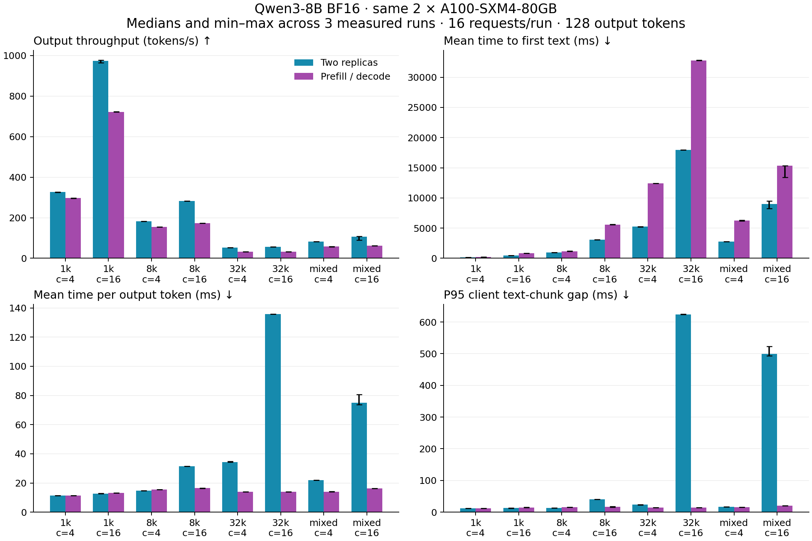
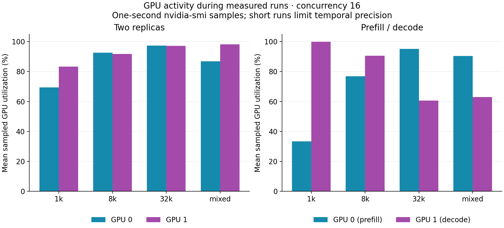
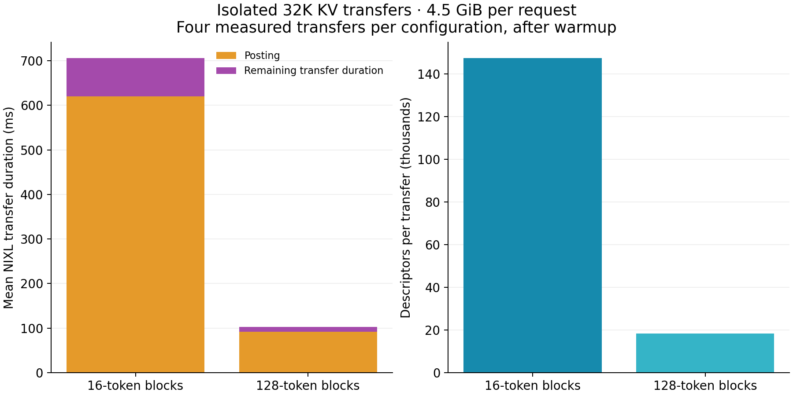
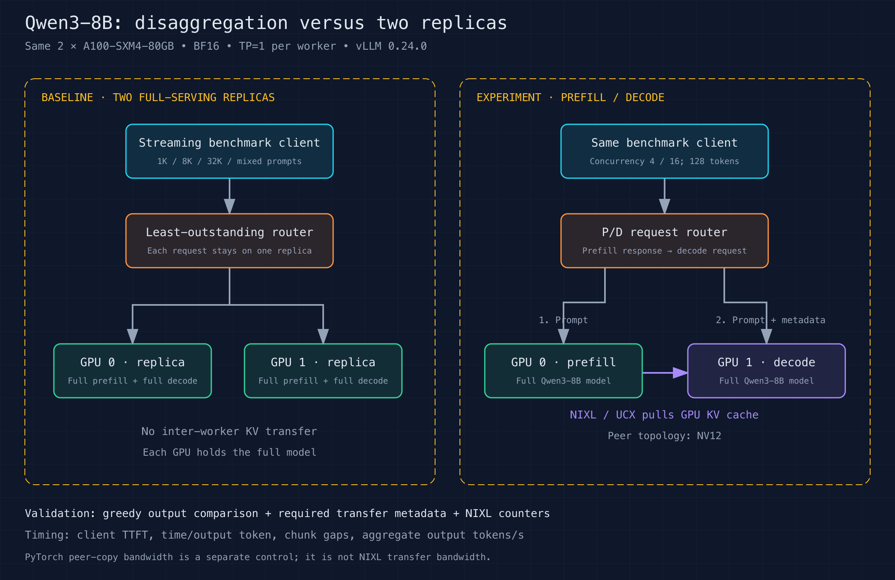
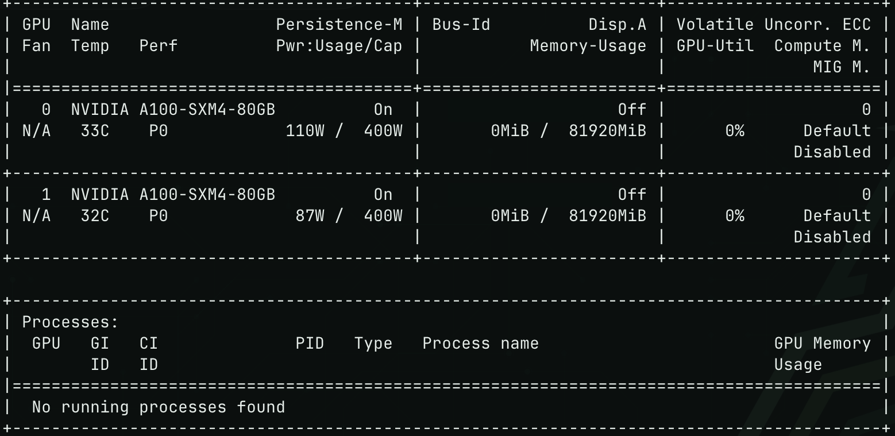
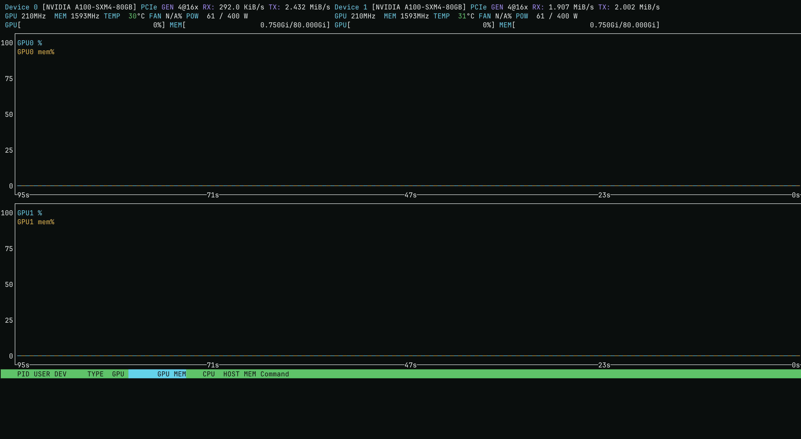
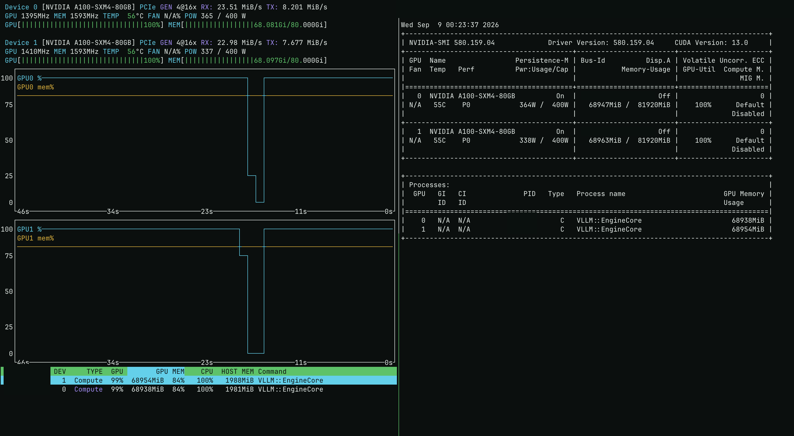
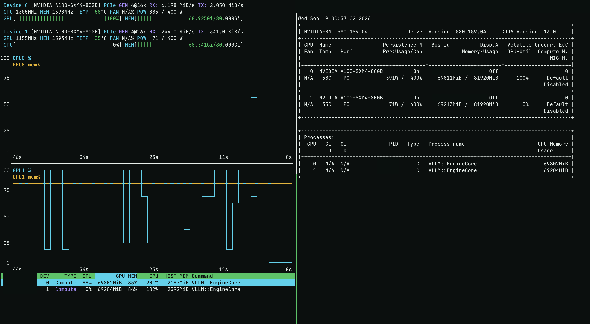

# Which request shapes benefit from prefill/decode disaggregation?

This study asks when separating prefill and decode is useful at a fixed
two-GPU budget. Input/output length, concurrent requests, and the relative
service capacity of the two stages determine the workload we need to measure.

On two A100-SXM4-80GB GPUs, the original Qwen3-8B P/D configuration reduced
long-prompt generation stalls but lost throughput in all eight workload cells.
At 32K prompts and concurrency 16, mean time per output token fell from
**135.7 ms to 13.8 ms**, while output throughput fell from **56.7 to 32.8 tokens/s**
and mean TTFT rose from **18.0 to 32.8 seconds**.

The original comparison and greedy-output diagnostic are complete. Targeted
scheduling controls and a sustained workload-shape comparison are in progress.
Use Qwen3-8B in BF16 with vLLM 0.24.0 and NIXL 1.2.0. The checkpoint revision
is pinned in [the configuration](configs/experiment.json). A dense model with
ordinary attention makes KV-transfer behavior easier to interpret than adding
MoE routing to the experiment.

The request router sends the prompt to the prefill worker, obtains KV-transfer
metadata, then sends the generation request to the decode worker. NIXL transfers
the actual KV cache between workers. Both workers load the full model. This is
prefill/decode separation, not a split of model layers across GPUs.

## Original measured results



[SVG](results/comparison.svg) · [Run statistics](results/runs.csv) ·
[Request timings](results/requests.csv) · [Summary](results/summary.json)

Values below are medians of three measured runs. TTFT and TPOT columns show
**replicas → P/D**. Throughput counts output tokens across both GPUs.

| Prompt | Concurrency | Replicas tok/s | P/D tok/s | P/D throughput ratio | Mean TTFT (ms) | Mean TPOT (ms) |
| --- | ---: | ---: | ---: | ---: | ---: | ---: |
| 1k | 4 | 326.4 | 297.3 | 0.91× | 124 → 236 | 11.3 → 11.4 |
| 1k | 16 | 974.2 | 722.3 | 0.74× | 461 → 846 | 12.7 → 13.1 |
| 8k | 4 | 182.1 | 155.2 | 0.85× | 935 → 1176 | 14.7 → 15.4 |
| 8k | 16 | 283.0 | 173.7 | 0.61× | 3090 → 5593 | 31.4 → 16.4 |
| 32k | 4 | 52.7 | 32.8 | 0.62× | 5260 → 12428 | 34.4 → 13.8 |
| 32k | 16 | 56.7 | 32.8 | 0.58× | 17986 → 32798 | 135.7 → 13.8 |
| mixed | 4 | 81.4 | 57.4 | 0.70× | 2792 → 6225 | 22.0 → 14.1 |
| mixed | 16 | 106.2 | 61.8 | 0.58× | 8991 → 15315 | 74.9 → 16.3 |

The mixed/concurrency-16 replica runs ranged from 89.4 to 108.3 tokens/s.
Per-worker prompt counters show a 3/5 split of long requests in the slower run,
despite equal request counts. That motivates a prompt-length-aware routing
control in the tuning pass. Three repetitions are insufficient to establish a
production tail-latency distribution.



[SVG](results/gpu-activity.svg) · [Sample aggregates](results/gpu-samples-summary.csv)

The one-second monitor samples show different bottlenecks across workloads:
the P/D decode GPU is busiest on short prompts; the prefill GPU dominates on
long prompts. Utilization is a coarse activity signal, not achieved FLOP/s.

The original sweep completed **768 timed requests** across 48 measured runs.
Including warmups and the eight correctness requests per mode, each mode served
520 logical requests. The P/D decoder recorded **520 NIXL transfers and
1,123,742,121,984 bytes**, with zero failed transfers, failed notifications,
expired KV requests, or preemptions. The byte count exactly matches the expected
BF16 KV payload for all 520 prompts. [Payload check](results/kv-byte-validation.json).
All timed requests returned the expected
prompt length and 128 output tokens.
[Connector counters](results/connector-metrics.json) ·
[Router counts](results/router-summary.json).

Exact greedy text agreement was **7/8**, with one 8K case differing. Follow-up
checks repeated P/D and local generation on each worker three times; each path
was stable. P/D matched all 64 tokens from local generation on the prefill GPU,
while local generation on the decode GPU diverged at generated token 36.
For an identical common-prefix prompt, the local decode path had a tied top-two
choice; the P/D path had a 0.25-nat top-two margin. The maximum difference among
five shared top-token log probabilities was 0.383 nats.

These checks demonstrate a local-path difference even without transferring KV;
they do not prove bitwise cache equality or identify the exact numerical cause.
The result remains **7/8 exact output agreement**, not full numerical correctness
or model-quality equivalence. [Diagnostic summary](results/diagnostics.json).
[Agreement checks](results/correctness.json).

## Targeted transfer optimization

A 32K prompt requires 4.5 GiB of BF16 KV data. In a separate serial NIXL probe,
changing the cache block size from 16 to 128 tokens reduced descriptors per
transfer from **147,456 to 18,432**. Across four measured transfers after warmup,
mean transfer duration fell from **706.2 to 102.4 ms**, with posting time falling
from **619.6 to 91.9 ms**. All four transfers succeeded in both configurations.
This is a connector measurement, separate from the PyTorch peer-copy control.



[SVG](results/tuning/transfer-overhead.svg) · [Numeric results](results/tuning/transfer-probe.json)

The P/D serving improvement was much smaller: roughly 2% on the 32K/concurrency-16
workload. Faster transfer cannot remove the dominant prefill computation. A
replica control with the same 128-token blocks, larger and smaller batch budgets,
and prompt-weighted routing is being measured separately. UCX protocol logs
confirmed a CUDA IPC zero-copy path for GPU-buffer transfers; the logs remain
private. The V2 worker's cross-layer KV-layout support was marked unimplemented
in the installed code, so that option was not tested.

## Concurrent stages and workload shape

Within a request, prefill must finish before its decode call starts. Across
requests, the router runs asynchronous handlers: prefill for a later request can
coexist with decode for an earlier one. There is no global alternating P/D loop.
The original 16-request/concurrency-16 cells are a single burst; long prompts
with only 128 generated tokens can leave the decode worker waiting for prefill.

The follow-up keeps 16 requests in flight over 32 requests per run, with one
warmup and three measured runs. Both serving modes use 128-token KV blocks and
a 4K batch budget. The workloads are 1K input/1K output, 8K input/512 output, and
32K input/128 output. The middle case is a candidate for stage balance, not a
claim that token counts translate to equal compute. We record actual HTTP-stage
intervals to distinguish concurrent requests from a globally serialized loop;
those intervals include queueing and KV transfer and are not GPU kernel traces.
[Workload configuration](configs/shapes.json).

## What we are comparing



[SVG](results/architecture.svg) · [Diagram source](analysis/architecture.py)

The baseline runs two independent full-serving replicas. The shared HTTP router
sends each request to the replica with fewer outstanding requests. The P/D
configuration dedicates GPU 0 to prefill and GPU 1 to decode. It uses the same
router implementation and hardware allocation, with the additional prefill
request and NIXL handoff included in client latency. Each phase runs separately.

vLLM frames disaggregation around independently tuning prefill and decode latency
and reducing generation stalls caused by incoming prefills. Its documentation
does not present it as a general throughput optimization. We measure throughput
alongside latency to expose the hardware-cost tradeoff.
[Source](https://docs.vllm.ai/en/v0.24.0/features/disagg_prefill/).

This follows the earlier [Cohere megakernel exercise](../06_cohere_megakernel/),
but asks a different question: does separating serving phases improve the
latency/throughput tradeoff at the same two-GPU budget? This exercise uses vLLM's
ordinary Qwen3 execution and real NIXL KV transfers; it does not run the Cohere
megakernel or use the synthetic DecodeBenchConnector.

## Method and validation

The fixed workload uses 1,024, 8,192, and 32,768 prompt tokens, plus an equal mix
of 1K and 32K requests shuffled with seed 42. Prompts are supplied as token IDs
so their lengths are exact. They are synthetic repeated document text, not a
production prompt distribution. Each cell sends 16 requests with client
concurrency 4 or 16 and generates exactly 128 output tokens (greedy sampling,
EOS ignored). One warmup run precedes three measured repetitions per cell.
This is a finite closed-loop workload, not an arrival-rate saturation test.

Both workers use BF16 weights and KV cache, tensor parallel size 1, a 33,792-token
context limit, 16 maximum sequences, a 4,096-token batch budget, 85% GPU-memory
utilization, seed 42, and disabled prefix caching. NIXL selects HND cache layout;
the replica path uses the ordinary default. Compilation, CUDA graph capture,
and model loading finish before benchmark timing. Warmup results stay private.

The same eight fixed inputs (128, 1K, 8K, and 32K tokens; two cases each) produce
64 greedy output tokens through both paths for exact text comparison. This
checks serving agreement on those inputs, not model quality or general numerical
equivalence. Every timed request must return its expected prompt count and all
128 output tokens with a length stop.

The P/D router requires nonempty remote KV block metadata, and the connector uses
`kv_load_failure_policy=fail`. A real request from outside the pod, through an SSH
tunnel, successfully processed 1,416 prompt tokens and generated 32 tokens.
The smoke session recorded two successful NIXL transfers and zero transfer or
notification failures. Connector byte counts and failure counters are collected
again for the full benchmark.

Client TTFT is time to the first nonempty text chunk. Time per output token is
(first-to-last text time)/(output tokens − 1). Text chunks can contain several
tokens, so client chunk gaps are not exact GPU inter-token latency. Throughput
is total generated tokens divided by batch makespan, including queueing and the
P/D handoff. Request latency begins after admission by the client concurrency
semaphore; server-side queueing is included. Figures show the median and min–max of three run-level statistics;
p95 values in the importer use linear interpolation. Sixteen requests per run
provide limited evidence about tail latency. Monitor samples are collected once
per second outside the HTTP request path.

## Setup findings

Both GPUs expose 108 SMs, peer access succeeds in both directions, and topology
reports NV12. A separate 256 MiB PyTorch peer-copy test (32 copies per trial,
three trials) measured **269.4–270.1 GB/s** from GPU 0 to GPU 1. Round-trip data
comparison passed. These numbers are a hardware control, not measured NIXL
transfer bandwidth. See [hardware results](results/hardware.json).

The [observed package pins](configs/requirements.txt) record the complete Python
environment. The setup script pins vLLM and NIXL but resolves their transitive
dependencies; consult the recorded pins for an exact-environment reproduction.

The first serving startup failed because the image lacked the `ninja` executable
needed for FlashInfer compilation. Installing `ninja-build` fixed startup;
[setup.sh](src/setup.sh) includes the dependency. Failed logs remain private.
The optional `nixl_ep` extension warned about a missing CUDA 12 runtime; the
NIXL KV-transfer backend initialized and served requests successfully.

## Why the topology matters

The pinned model has 36 layers, eight KV heads, and head dimension 128. BF16
KV storage is therefore `2 × 36 × 8 × 128 × 2 = 147,456` bytes per token,
or 1.125 GiB for 8,192 tokens, before transfer protocol overhead.

Runpod documents its ordinary private pod network at 100 Mbps. Transferring
that 8K cache at the documented rate alone would take approximately 97 seconds.
Separate ordinary pods would therefore be a network-constrained experiment.
Two workers on a dual-GPU node allow testing the local GPU interconnect instead;
the local NV12 topology and peer-copy control above were verified on this node.
Runpod Instant Clusters provide faster inter-node networking but are documented
as starting at two eight-GPU nodes, beyond this experiment's two-GPU scope.

Sources: [model configuration](https://huggingface.co/Qwen/Qwen3-8B/blob/b968826d9c46dd6066d109eabc6255188de91218/config.json),
[vLLM NIXL guide](https://docs.vllm.ai/en/v0.24.0/features/nixl_connector_usage/),
[Runpod global networking](https://docs.runpod.io/pods/networking),
[Runpod Instant Clusters](https://docs.runpod.io/instant-clusters).

## User screenshots

The first two user-provided captures are from setup, before benchmark load. These
show device availability and idle monitoring, not measured serving performance.
Terminal tabs, account/host details, and the first capture's upper banner were
cropped away; PCI bus addresses were covered with opaque redaction. Retained
pixels were verified unchanged, with no resizing or generative image editing.
Original captures remain private.





The third capture was taken at 00:23:37 UTC during **replicas, 32K prompts,
concurrency 4, measured repetition 2**, matched to the saved run window. Both
vLLM engines are active. The displayed GPU readings and history remain unchanged;
terminal identifiers, PCI addresses, and process identifiers are redacted.
The preceding utilization dip spans a boundary between runs.



The fourth capture shows P/D at 00:37:02 UTC: GPU 0 runs prefill while GPU 1
waits between decode bursts. The saved run window identifies **P/D, 32K prompts,
concurrency 4, measured repetition 2**. GPU memory remains reserved even
when utilization is zero; the flat memory line does not indicate active decoding.



The reproducible [cropping script](analysis/sanitize_screenshots.py) writes
lossless PNGs and verifies the retained pixels against the private originals.

## Reproduce

Use one node exposing exactly two identical GPUs with working peer access. The
recorded run used the Runpod PyTorch image
`runpod/pytorch:1.0.7-cu1300-torch291-ubuntu2404-cluster`, with the experiment's
separate environment installed by the setup script. The image tag is recorded,
but its container digest was not captured.

Copy `src/` contents to `/workspace/disagg/` on the GPU node, then run:

```bash
cd /workspace/disagg
bash setup.sh
python3 run.py --mode pd --smoke-only
```

The smoke runner holds its local HTTP router open after the first successful
request. Forward local port 8000 through SSH, send a real completion request from
outside the pod, verify its output, and create `/workspace/disagg/EXTERNAL_SMOKE_COMPLETE`
on the node within five minutes. Then execute the benchmark phases:

```bash
bash experiment.sh
bash tuning.sh
bash shapes.sh
```

Workers bind to loopback. Connection details belong in local SSH configuration,
not this repository. Capture one-second GPU monitoring to private storage during
the experiment if reproducing the activity figure:

```bash
nvidia-smi --query-gpu=timestamp,index,utilization.gpu,utilization.memory,memory.used,power.draw \
  --format=csv,noheader,nounits -l 1 > raw/gpu-monitor.csv
```

Retrieve `raw/` privately before terminating the node. Import reviewed summaries
on a machine with NumPy, Matplotlib, and Pillow:

```bash
python3 analysis/summarize.py /path/to/private/raw
python3 analysis/monitor.py /path/to/private/raw
python3 analysis/architecture.py
python3 analysis/tuning.py /path/to/private/raw
python3 analysis/transfer.py /path/to/private/raw
python3 analysis/shapes.py /path/to/private/raw
```

The original requests, generated text, model files, machine metadata, worker
logs, and connection configuration are excluded from Git. Public result files
contain reviewed numeric aggregates and request timings. Screenshots require
the separate private originals and the lossless cropping script above.
