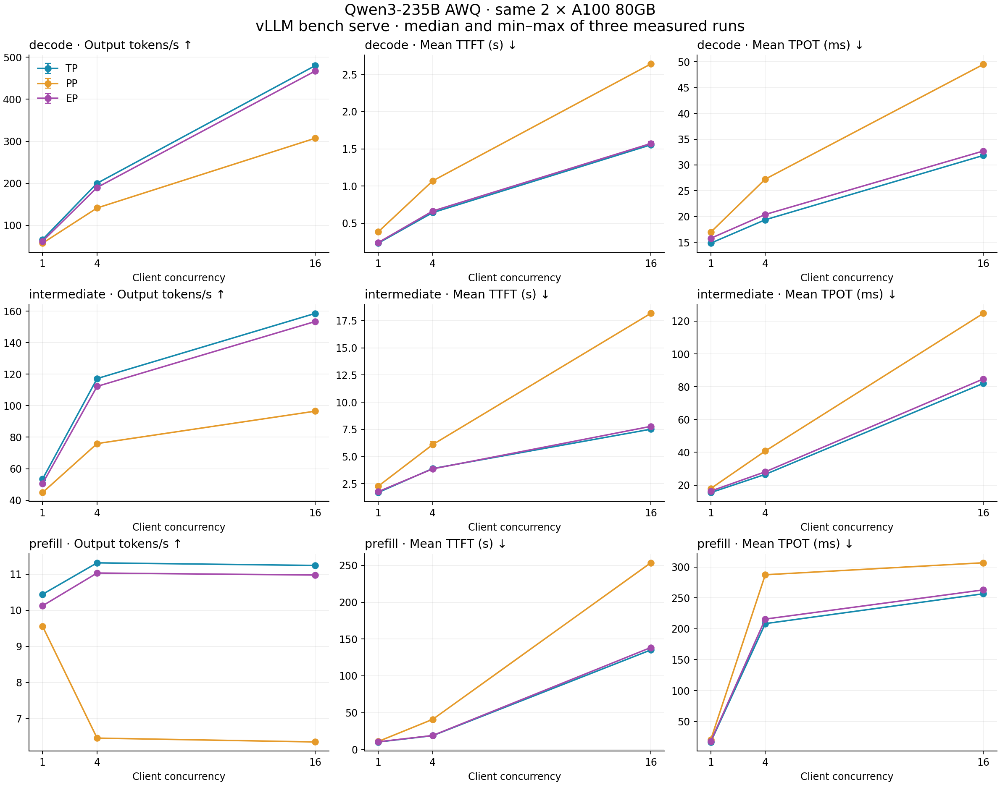
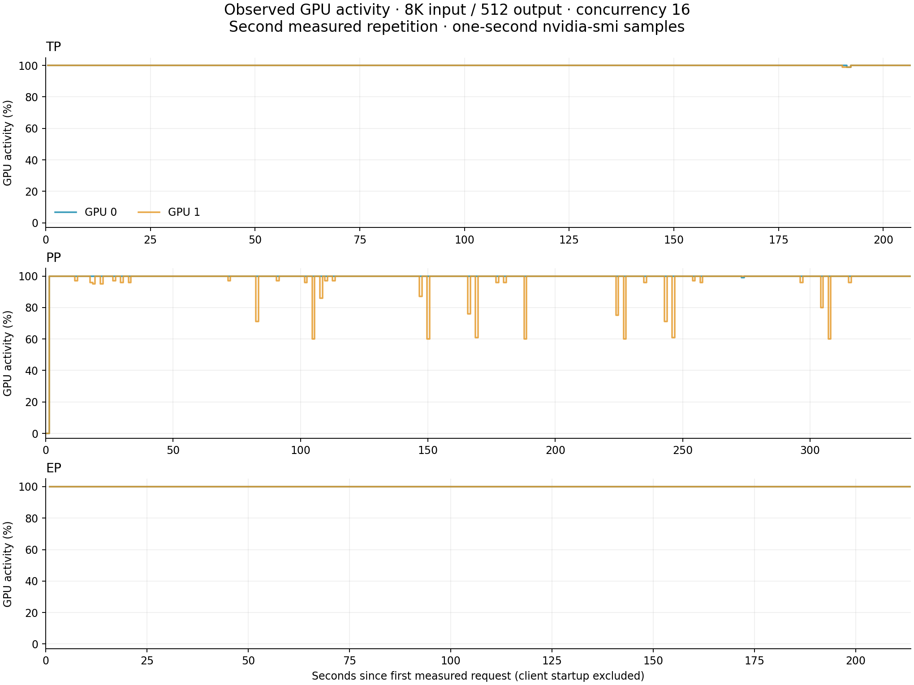

# Qwen3-235B across two A100 80GB GPUs

**Completed: 81 measured runs, 2,592 timed requests, zero failed timed requests.**
QuantTrio Qwen3-235B-A22B Thinking AWQ served successfully with TP=2, PP=2,
and TP=2 plus expert parallelism on the same two A100-SXM4-80GB GPUs.
TP had the highest output throughput in all nine workload cells. EP was
2.4–5.9% slower than TP; PP was 8.5–43.4% slower. These are results for this
checkpoint, runtime, node and workload, not a universal ranking of parallelism.

This is the capacity and parallelism follow-up to
[exercise 07: prefill/decode disaggregation versus replicas](../07_disaggregated_serving/).
That experiment used two complete 8B model workers; this one distributes a
single 235B model across both GPUs. The baseline here is tensor parallelism,
not replicas or the Cohere megakernel. The repository records reproducible
inference experiments, including failures, controls and limits on conclusions.

## Measured performance

All values below are medians of three measured repetitions. Output throughput
includes prompt processing and request drain time; it is not isolated decode
kernel throughput. Every mode uses both GPUs at the same rental cost.

| Input/output tokens | Concurrency | TP tok/s | PP tok/s | EP tok/s |
| --- | ---: | ---: | ---: | ---: |
| 968 / 1,024 | 1 | 66.51 | 57.78 | 62.56 |
| 968 / 1,024 | 4 | 200.26 | 141.49 | 190.27 |
| 968 / 1,024 | 16 | 479.94 | 307.28 | 467.11 |
| 8,136 / 512 | 1 | 53.46 | 44.87 | 50.59 |
| 8,136 / 512 | 4 | 117.20 | 75.95 | 112.25 |
| 8,136 / 512 | 16 | 158.56 | 96.52 | 153.42 |
| 32,712 / 128 | 1 | 10.44 | 9.55 | 10.12 |
| 32,712 / 128 | 4 | 11.31 | 6.46 | 11.03 |
| 32,712 / 128 | 16 | 11.24 | 6.35 | 10.97 |



[SVG](results/parallelism.svg) · [All run metrics](results/runs.csv) ·
[Cell medians and min/max](results/summary.json) · [Per-request timings](results/requests.csv)

At concurrency 16 with 968 input / 1,024 output tokens, TP reached **479.94 tok/s**,
EP 467.11 and PP 307.28. Mean TTFT was 1.55 / 1.57 / 2.64 seconds and mean
TPOT was 31.85 / 32.71 / 49.52 ms for TP / EP / PP respectively.

The long-input workload saturated early: TP rose from 10.44 tok/s at concurrency
1 to 11.31 at concurrency 4, then remained at 11.24 at concurrency 16. Its mean
TTFT nevertheless rose from 10.12 to 18.74 to 135.16 seconds. More queued work
therefore bought little throughput while substantially increasing latency.
PP throughput actually fell from 9.55 to 6.46 to 6.35 tok/s over the same sweep.
The traces do not isolate a kernel or collective cause for that regression.

TP and EP each recorded four preemptions in every measured 8K/concurrency-16
run: 12 measured preemptions per mode, plus one during warmup. PP recorded none,
yet remained slower. This is observed cache/scheduler behavior under the fixed
memory and batching settings; absence of preemption alone did not predict speed.
EP had slightly lower mean TTFT than TP in the 8K/concurrency-4 cell, so TP's
throughput lead should not be read as winning every latency statistic.

## What ran and what we verified

The pinned checkpoint is
[QuantTrio/Qwen3-235B-A22B-Thinking-2507-AWQ](https://huggingface.co/QuantTrio/Qwen3-235B-A22B-Thinking-2507-AWQ/tree/38e8e75808020b2c9be573c19629a4d02cd8e8aa),
revision `38e8e75808020b2c9be573c19629a4d02cd8e8aa`.
It has 235B total parameters, approximately 22B active per token, 94 layers,
128 experts and eight selected experts per token. All expert weights must be
available despite the smaller active parameter count. The tensor index contains
124,055,313,408 bytes (124.06 GB / 115.54 GiB), across 25 safetensors shards.
AWQ uses INT4 weights, group size 128 and asymmetric zero points. Activations
and KV cache are BF16. CPU weight offload is disabled.

| Mode | Executed arrangement | Logged model allocation (GiB) | Logical KV capacity (tokens) |
| --- | --- | ---: | ---: |
| TP | TP=2, PP=1, EP disabled | 57.92 | 132,000 |
| PP | TP=1, PP=2, EP disabled | 58.99 | 121,760 |
| EP | TP=2, PP=1, EP enabled | 57.92 | 131,824 |

Model allocation is the worker load message available in the captured logs,
not a sum across GPUs or a complete per-rank memory decomposition. Logical KV
capacity is the engine-reported usable capacity, not a sum of duplicate rank
counts. EP startup explicitly confirmed linear expert placement and 64 of 128
experts local to rank 0. Attention retained TP=2. This was not a DP=2 expert
parallel deployment; that optional arrangement was not run. Collective traffic
was not separately profiled, so no all-to-all bandwidth claim is made.

All three modes selected FlashAttention, Marlin MoE and Marlin AutoAWQ linear
kernels under vLLM 0.24.0, PyTorch 2.11.0 with CUDA 13.0, and Transformers 5.16.1.
The driver was 580.159.04. Both GPUs have 80 GiB and a 400 W power limit.
The topology probe verified NV12 connectivity and peer access in both directions;
a separate 256 MiB copy control measured about 273 GB/s in direction GPU 0 to
GPU 1. This control is not inference communication bandwidth.

[Hardware](results/hardware.json) · [Environment and startup](results/runtime.json) ·
[Checkpoint metadata](results/checkpoint.json) · [Executed settings](configs/plan.json)

Every mode completed 27 measured runs and 864 timed requests. Including separate
warmups and six smoke checks, each server's final counters reconciled to exactly
942 successful requests and 519,552 generated tokens. The full sweep generated
1,437,696 tokens in timed requests. All phase exit codes were zero and the
experiment completion marker was present. Both GPUs were empty and no serving
processes remained at final inspection. See [validation](results/validation.json).

The six 64-token greedy checks showed **PP matching TP in 1/6 cases and EP in
4/6 cases**. These differences are retained in [agreement results](results/correctness.json).
They prevent claiming identical outputs or numerical equivalence. Their cause
was not diagnosed, and no reference-answer accuracy evaluation was performed.
Forced-length throughput can be compared, but these checks do not establish
interchangeable answer quality.

## Actual GPU activity



[SVG](results/gpu-timeline.svg) · [Per-run GPU measurements](results/gpu-activity.csv)

These are actual one-second samples for the second measured 8K/concurrency-16
run in each mode. Each panel spans first request dispatch through last streamed
token and has its own time scale. PP takes longer despite both devices reporting
high activity for much of the run. GPU utilization includes time that can be
spent in communication or waiting inside kernels; it is not FLOP efficiency and
does not prove pipeline overlap. No kernel-level trace was collected here.
The benchmark's monotonic clock was aligned to wall time using a captured anchor;
the final anchor differed in offset by about 1.4 microseconds, far below the
one-second sampling interval.

## Benchmark controls and limits

The harness is **`vllm bench serve`**, using the OpenAI completions backend and
custom documents. Each mode runs separately on the same node. Full servers use
a 33,792-token context limit, 16 maximum sequences, 4,096 batched tokens,
90% GPU memory utilization, chunked prefill and disabled prefix caching.
Seed 42, temperature zero, `--ignore-eos` and `--custom-output-len -1` hold
request order and output budgets fixed. Effective commands and source snapshots
are preserved privately; [run.py](src/run.py) contains the launch and client flags.

For each shape and concurrency (1, 4, 16), one separate warmup precedes three
measured repetitions. Each measured run submits `max(16, 4 * concurrency)`
requests, giving 16, 16 and 64 requests respectively. Request rate is `inf`
with a client concurrency cap: a closed-loop load test. TTFT and end-to-end
latency exclude waiting for a client concurrency slot, while aggregate run
duration includes dispatch and drain. Reported TTFT/TPOT cells are medians of
three run means; min/max bars show repeat spread, not confidence intervals.
Streaming ITL and end-to-end percentiles are retained in the numeric files.
No latency SLO was set, so throughput is not SLO-qualified goodput.

Modes ran in TP, PP, EP order, without locked clocks or randomized mode order.
This is one host with three repetitions, not a multi-host statistical study.
Small request counts limit tail-latency conclusions. The corrected pilot used
a shorter context limit and is excluded from this comparison; see
[pilot measurements](results/pilot.json). These are custom serving measurements,
not official MLPerf results or a scored LongBench evaluation.

The private input builder selects documents from LongBench's `qasper`,
`gov_report`, and `hotpotqa` tasks at pinned revision
`5e628be450b7e67fb7ae6e201bd6d8f7056f7672`. It truncates context to the target
budget while retaining the source row's input field and the model's chat template. It
records actual token lengths, source counts, and file hashes. These modified,
forced-length prompts are serving workloads, not a scored LongBench evaluation.
The source pool is repeated if fewer than 64 eligible documents are available;
prefix caching is disabled in every mode. CLI seed 42 fixes request shuffling.
The prepared inputs contain 968, 8,136, and 32,712 tokens respectively. The
first two shapes use 64 distinct source documents each; the longest shape has
only three eligible documents, repeated to fill the 64-request pool. That limits
its content diversity; it is a controlled long-context stress test. Each mode
uses identical inputs within a workload cell. The source pool differs across
length profiles, so cross-profile changes cannot be attributed solely to length.

The source `gov_report` rows have empty `input` fields. This builder retains that
empty task under its generic document instruction: 28/64 short, 23/64 intermediate,
and all 64 long prompts have no explicit source question. A long-prompt smoke
output consequently asks for a task clarification. These results characterize
fixed-length document serving and do not measure successful summarization or
answer quality. Inputs are kept fixed across modes; a future task-oriented
workload should supply the missing summarization instruction before collecting
its baseline.

## Reproduce the study

Provide enough storage for the
124 GB checkpoint, environment, and private captures. This run uses a symlink
from the model directory to a shared-memory filesystem (233 GiB capacity),
avoiding slow persistent-volume reads. Weights are disposable and pinned for
redownload; all result captures remain on persistent storage. This filesystem
only supplies checkpoint files during loading. CPU weight offload is disabled;
the serving model weights reside on the GPUs. Copy `src/` to
`/workspace/qwen235b/`. These scripts use the recorded vLLM environment at
`/opt/disagg/venv`; install the environment before running on a fresh node.

```bash
uv pip install --python /opt/disagg/venv/bin/python 'vllm[bench]==0.24.0'
cd /workspace/qwen235b
bash experiment.sh
```

The workflow downloads the pinned checkpoint, prepares private inputs, verifies
the TP pilot, then runs TP, PP and EP in separate server processes. Each phase
retains its exit status and logs. A failed full phase does not prevent trying
the remaining modes. `EXPERIMENT_COMPLETE` is written only if all three succeed.
Keep the rental until raw archives are verified and reviewed results are pushed.

Import completed modes locally with:

```bash
python3 analysis/summarize.py /path/to/private/raw
```

The initial TP launch loaded the model and passed four 64-token smoke checks,
but the first benchmark client exited before timed requests because the
benchmark extras were missing. Installing `vllm[bench]` preserved vLLM 0.24.0
and PyTorch 2.11.0. During setup review, the command was also corrected to use
`--custom-output-len -1`: this CLI otherwise overrides dataset output budgets
with its 256-token default. The corrected harness asserts both completed
request count and total output-token count for every run. Failed setup logs
and the initial GPU trace are retained privately; they are excluded from
measured serving results.

TP and EP logs also contain EngineDeadError messages after the harness sent
SIGTERM for server teardown, following final metrics capture. They were not timed
request failures. The shutdown warnings and failed initial setup remain in the
private archive rather than being discarded.

## Capture and lifecycle

The complete raw benchmark JSON, prompts and outputs, server logs, launch
commands, counters, GPU samples, clock anchors and executed source snapshots
were archived and copied locally. Remote and local SHA-256 checksums matched;
[verification metadata](results/capture.json) identifies the private archive.
Raw text and private connection details are excluded from Git. The public
artifacts contain reviewed numeric results and charts generated from these tests.
Exercise 07 also retains the user's losslessly cropped/redacted screenshots.

The rental is awaiting the reviewed final-results push; teardown follows that
push as authorized. The preceding H100 rental was already terminated.
